# Architekturdokumentation CanKit (arc42)

**Projekt:** CanKit – .NET-CAN-Bus-Bibliothek
**Dokumenttyp:** Architekturdokument nach [arc42](https://arc42.org)
**Stand:** 2026-07-14 · Basis: `master` @ `36866ff`
**Ziel-Frameworks:** `netstandard2.0`, `net8.0`, `net8.0-windows`

> **Lesehinweis zum Ist/Ziel-Kontrast.** Dieses Dokument beschreibt bewusst zwei
> Zustände: den **Ist-Zustand** (heute im Repository vorhandene, produktionsnahe
> Architektur der Ebenen L0/L1) und die **Ziel-Architektur** für die Protokoll-Stacks
> (L2–L4). Neue oder noch nicht implementierte Bausteine sind durchgängig mit dem
> Marker **(NEU / Ziel)** gekennzeichnet, vorhandene mit **(vorhanden)**. Der ISO-TP-Transport
> (L3) existiert heute nur als **unfertiger Prototyp** und wird entsprechend markiert.
>
> Requirement-IDs verweisen auf das parallel entstehende SRS
> (`docs/requirements/SRS-CanKit.md`); Schema: `FR-RAW-*`, `FR-TP-*`, `FR-UDS-*`,
> `FR-CO-*`, `FR-J1939-*`, `FR-HAWE-*`, `NFR-*`, `CON-*`. Die technischen Schulden in
> Abschnitt 11 sind aus dem Deep-Code-Review (`docs/reviews/2026-07-14-deep-code-review.md`)
> abgeleitet; dessen Abschnittsnummern werden als „Review §x.y" referenziert.

---

## Kanonische Schichten-Nomenklatur (L0–L4)

Diese Nomenklatur ist identisch zur SRS und wird im gesamten Dokument verwendet:

| Ebene | Name | Status | Inhalt |
|-------|------|--------|--------|
| **L0** | Adapter-Ebene | vorhanden | 7 Vendor-Adapter + Virtual + Fake-Native-Schicht |
| **L1** | Raw-CAN-Kern | vorhanden | `ICanBus`, `CanFrame`, Registry, Utilities, Diagnostics |
| **L2** | Raw-CAN-Dienstebene | **NEU / Ziel** | Multi-Consumer-Demux, Ownership-Vertrag, TX-Confirm, Adressierung, Aktor-Modell, Fehler-/Timeout-Infrastruktur |
| **L3** | Transport-Ebene | Prototyp (ISO-TP) / MVP (J1939-TP, Paket `CanKit.Pro.J1939Tp`) | ISO-TP (ISO 15765-2), J1939-TP (BAM/CM) |
| **L4** | Anwendungsprotokoll-Ebene | **NEU / Ziel** | UDS, CANopen, J1939-App, HAWE-Privatprotokoll |

### Auflösung der Requirement-Referenzen (arc42 ↔ SRS)

Dieses Dokument verwendet für die L2-Dienstebene aus Lesbarkeitsgründen **thematische
Mnemonik-Suffixe** (`FR-RAW-OWN-*`, `FR-RAW-DEMUX-*`, …). Die SRS
(`docs/requirements/SRS-CanKit.md`) führt dieselben Anforderungen unter **fortlaufenden
Nummern**. Die folgende Tabelle ist der verbindliche Schlüssel; jede Mnemonik löst auf
einen SRS-Nummernbereich auf:

| arc42-Mnemonik | SRS-Nummernbereich | Thema (SRS §) | Baustein |
|----------------|--------------------|---------------|----------|
| `FR-RAW-OWN-*`, `FR-RAW-FRAME-*` | `FR-RAW-001..005` | Frame-Ownership-/Lifetime-Vertrag (§4.1.1) | `CanFrame`/`CanFrameView` (L1, vorhanden) + Ownership-Regeln (L2, NEU) |
| `FR-RAW-DEMUX-*`, `FR-RAW-OBS-*`, `FR-RAW-SVC-*` | `FR-RAW-010..014` | Multi-Protokoll-Demultiplexing / Subscription (§4.1.2) | `ICanBusService` / `ISubscription` (L2, NEU) |
| `FR-RAW-ACTOR-*`, `FR-RAW-ASYNC-*` | `FR-RAW-020..024` | Threading-/Aktor-Modell pro Protokollinstanz (§4.1.3) | Protokollinstanz-Aktor/Scheduler (L2, NEU) |
| `FR-RAW-TXC-*` | `FR-RAW-030..034` | TX-Bestätigungs-Abstraktion (§4.1.4) | TX-Confirm-Dienst (L2, NEU) |
| `FR-RAW-ADDR-*` | `FR-RAW-040..041` | Adressierungs-/ID-Helfer (§4.1.5) | ID-Helfer (L2, NEU) |
| `FR-RAW-ERR-*`, `FR-RAW-TIMEOUT-*` | `FR-RAW-050..052` | Fehler-/Timeout-Infrastruktur (§4.1.6) | Deadline-/Fehler-Primitive (L2, NEU) |
| `FR-RAW-ADAPTER-*`, `FR-RAW-BUS-*`, `FR-RAW-DISC-*` | *(kein dediziertes FR)* | Bestehende L0/L1-Bausteine (in SRS als „vorhanden", über NFR/CON abgedeckt) | `ICanBus`, `ITransceiver`, `CanRegistry` |

> Hinweis: `FR-RAW-ADAPTER/BUS/DISC` markieren **vorhandene** L0/L1-Bausteine, für die die
> SRS keine eigene FR-Nummer vergibt (Ist-Zustand); ihre Qualitätsanforderungen stecken in
> den `NFR-*`/`CON-*`. Alle übrigen Mnemoniken sind Ziel-Anforderungen mit auflösbarem
> SRS-Bezug.

---

# 1. Einführung und Ziele

## 1.1 Aufgabenstellung

CanKit ist eine **herstellerneutrale .NET-Bibliothek für den CAN-Bus** (Classic CAN 2.0
und CAN FD). Sie kapselt heterogene Vendor-Treiber (SocketCAN, ZLG, PCAN, Kvaser,
Vector, ControlCAN) hinter einer einheitlichen API (`ICanBus`) und stellt darüber
hinaus eine Erweiterungsplattform (SPI + Registry) bereit, auf der Transport- und
Anwendungsprotokolle (ISO-TP, UDS, J1939, CANopen, HAWE) aufsetzen können.

Kernanliegen:

- **Ein API, viele Hardware-Vendoren** – Anwendungscode ist von der konkreten
  CAN-Hardware entkoppelt; der Wechsel des Adapters erfolgt idealerweise über einen
  Endpoint-String (`socketcan://can0`, `zlg://USBCANFD-200U?index=0#ch1`).
- **Multi-Target** – dieselbe Codebasis läuft auf `netstandard2.0` (u. a. .NET Framework),
  `net8.0` (Linux/macOS) und `net8.0-windows`.
- **Protokoll-Stacks aufsetzbar** – die Raw-CAN-Ebene ist Fundament für höhere
  Protokolle; die dafür nötigen Querschnittsdienste werden mit L2 (NEU) nachgezogen.
- **Testbarkeit ohne Hardware** – jede native Schicht besitzt eine `*.Fake.cs`-Variante
  (`-c Fake`), ergänzt durch einen In-Memory-`Virtual`-Adapter für Loopback-Tests.

## 1.2 Qualitätsziele (Top 5)

| # | Qualitätsziel | Motivation | SRS-Bezug |
|---|---------------|-----------|-----------|
| Q1 | **Erweiterbarkeit** | Neue Vendoren/Protokolle ohne Kern-Änderung via SPI + reflexionsbasierter Registry. | `NFR-EXT-*`, `CON-SPI` |
| Q2 | **Portabilität** | Identisches Verhalten über 3 TFMs und 3 Betriebssysteme; P/Invoke gekapselt. | `NFR-PORT-*`, `CON-TFM` |
| Q3 | **Echtzeitnähe / geringer Jitter** | Periodisches Senden und ISO-TP-STmin/BS-Timing brauchen präzises, plattformabhängiges High-Res-Timing. | `NFR-RT-*` |
| Q4 | **Testbarkeit** | Hardwarelose CI (Fake + Virtual-Loopback), deterministische Matrix-Tests. | `NFR-TEST-*` |
| Q5 | **Ressourceneffizienz** | Zero-Alloc-Ansätze via `readonly record struct CanFrame`, `IMemoryOwner`-Pooling, `Span`-basierte Codecs. | `NFR-RES-*` |

Die Qualitätsziele stehen teils in Spannung (siehe Abschnitt 10): Q3/Q5 (Pooling,
Zero-Copy) erhöhen den Aufwand für Q4 und für einen sicheren **Frame-Ownership-Vertrag**
(Abschnitt 8.1), der wiederum Voraussetzung für Q1 auf L2–L4 ist.

## 1.3 Stakeholder

| Rolle | Erwartung an die Architektur |
|-------|------------------------------|
| **Anwendungsentwickler** (Diagnose/Steuerung) | Stabile, hardwareunabhängige API; einfache Endpoint-Öffnung; async-Streaming. |
| **Adapter-Autor** (Vendor-Integration) | Klares Adapter-Muster (Bus/Transceiver/Options/Native), SPI-Verträge, Fake-Schicht als Vorlage. |
| **Protokoll-Autor** (ISO-TP/UDS/J1939/CANopen/HAWE) | Verbindlicher Ownership-Vertrag, Multi-Consumer-Demux, TX-Confirm, definiertes Threading-Modell (→ L2). |
| **Maintainer / Architekt** | Geringe Kopplung, testbare Kerne, dokumentierte Entscheidungen (ADRs), Kontrolle über Release-Reife. |
| **CI/Release-Engineer** | Adapterweise Pfadfilter, `-c Fake`-Builds, NuGet-Packaging, reproduzierbare Matrix. |
| **Endnutzer/Betreiber** | Zuverlässiges Verhalten unter Last, kein Ressourcenleck über lange Laufzeiten. |

---

# 2. Randbedingungen

## 2.1 Technische Randbedingungen

| ID | Randbedingung | Auswirkung |
|----|---------------|-----------|
| CON-TFM | Multi-Target `netstandard2.0; net8.0; net8.0-windows` (`src/Directory.Build.props`). | API muss auf dem kleinsten gemeinsamen Nenner (netstandard2.0) verfügbar sein; TFM-Weichen via `#if NET5_0_OR_GREATER` (z. B. `Queue.TryPeek`). |
| CON-PINV | Vendor-Zugriff via **P/Invoke** in `Native/*.cs`, je Adapter eine `*.Fake.cs`-Spiegelung. | Native-Schicht ist plattform- und bitness-abhängig; Fake ermöglicht hardwarelose Builds (`-c Fake` → `DefineConstants=FAKE`). |
| CON-SDK | Externe Vendor-SDKs (z. B. `Peak.PCANBasic.NET`, Kvaser `canlib`, ZLG, Vector XL). | NuGet-Abhängigkeiten pro Adapter; müssen aus dem ISO-TP-Paket entfernt werden (Review §1.1/16). |
| CON-LANG | `LangVersion=12`, `Nullable=enable`, Analyzer aktiv (`EnableNETAnalyzers`, `EnforceCodeStyleInBuild`). | Moderne C#-Sprachfeatures (record struct, primary ctors, collection expressions); netstandard2.0 braucht `IsExternalInit`-Shims. |
| CON-UNSAFE | `AllowUnsafeBlocks` in Codec/Transport (`FrameCodec` nutzt `Unsafe.CopyBlockUnaligned`). | Performante Frame-Erzeugung, aber erhöhter Review-Bedarf (Bounds-Sicherheit). |
| CON-DOC | `GenerateDocumentationFile=true`, zweisprachige (EN/ZH) XML-Doku. | Öffentliche API ist doppelt dokumentiert; Typos in der API sind Breaking Changes nach 1.0 (Review §3). |

## 2.2 Organisatorische Randbedingungen

- **OSS-Paket** (Apache-2.0), veröffentlicht als NuGet (`GeneratePackageOnBuild`, `snupkg`-Symbole).
- **Adapterweise CI** (`.github/workflows`) mit **Pfadfiltern**; Solution-Filter
  `CanKitAdapters.slnf` / `CanKitTransports.slnf`.
- **Default-Branch `master`** – einige Pipelines triggern noch auf `main` (toter Trigger, Review §3).
- Entwicklung durch kleines Team; Reife-Gefälle zwischen Kern (produktionsnah) und
  Transport (experimentell) muss durch `IsPackable`/„experimental"-Markierung sichtbar sein.

## 2.3 Konventionen

- **Adapter-Muster:** `<Vendor>Bus : ICanBus`, `<Vendor>Transceiver : ITransceiver`,
  `<Vendor>Options`/`OptionsConfigurator`, `Native/` (P/Invoke + Fake), `Registers/` mit
  `[CanRegistryEntry]`, `Providers/`, `<Vendor>Endpoint`.
- **Namespaces:** `CanKit.Abstractions.API.*` (öffentlich), `.SPI.*` (Erweiterungspunkte),
  `CanKit.Core.*`, `CanKit.Adapter.<Vendor>`, `CanKit.Transport.IsoTp`.
  (Ausnahme/Schuld: ISO-TP mischt `CanKit.Transport.IsoTp.*` und `CanKit.Protocol.IsoTp.*` – Review §3.)
- **Diagnostics:** zentral über `CanKitLogger` und `CanBusExceptionDispatcher`.
- **Zeitbasis:** gemischt `DateTime.Now`/`UtcNow` (Ist-Schuld, Review §2.5) – Ziel: einheitlich UTC.

---

# 3. Kontextabgrenzung

## 3.1 Fachlicher Kontext

CanKit vermittelt zwischen **Anwendungslogik** (Diagnose, Steuerung, Telemetrie) und
**physischen CAN-Knoten** (ECUs, Sensoren, Aktoren) über eine **CAN-Hardware/Treiber-Schicht**.
Fachliche Ein-/Ausgaben:

- **Eingehend:** rohe CAN/CAN-FD-Frames vom Bus, Fehlerframes, Bus-/Controller-Status,
  TX-Bestätigungen (Echo, sofern Hardware es liefert).
- **Ausgehend:** zu sendende Frames (einzeln/Batch/periodisch), Konfiguration
  (Bitrate, Filter, Work-Mode), Protokoll-PDUs (ISO-TP-Datagramme, künftig UDS/J1939/CANopen).

## 3.2 Technischer Kontext (C4-artiges Kontextdiagramm)

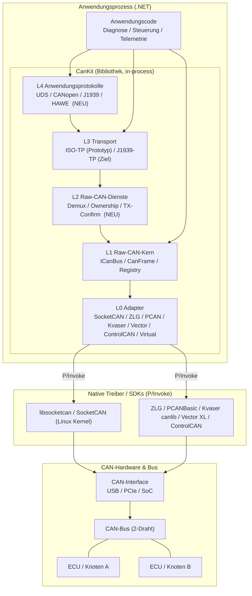
```mermaid
flowchart TB
    subgraph App["Anwendungsprozess (.NET)"]
        UserApp["Anwendungscode<br/>Diagnose / Steuerung / Telemetrie"]
        subgraph CanKitLib["CanKit (Bibliothek, in-process)"]
            L4["L4 Anwendungsprotokolle<br/>UDS / CANopen / J1939 / HAWE  (NEU)"]
            L3["L3 Transport<br/>ISO-TP (Prototyp) / J1939-TP (Ziel)"]
            L2["L2 Raw-CAN-Dienste<br/>Demux / Ownership / TX-Confirm  (NEU)"]
            L1["L1 Raw-CAN-Kern<br/>ICanBus / CanFrame / Registry"]
            L0["L0 Adapter<br/>SocketCAN / ZLG / PCAN / Kvaser / Vector / ControlCAN / Virtual"]
            L4 --> L3 --> L2 --> L1 --> L0
        end
        UserApp --> L4
        UserApp --> L3
        UserApp --> L1
    end

    subgraph Native["Native Treiber / SDKs (P/Invoke)"]
        LibSocketCan["libsocketcan / SocketCAN (Linux Kernel)"]
        VendorSdk["ZLG / PCANBasic / Kvaser canlib / Vector XL / ControlCAN"]
    end

    subgraph HW["CAN-Hardware & Bus"]
        Iface["CAN-Interface<br/>USB / PCIe / SoC"]
        Bus["CAN-Bus (2-Draht)"]
        ECU1["ECU / Knoten A"]
        ECU2["ECU / Knoten B"]
    end

    L0 -->|"P/Invoke"| LibSocketCan
    L0 -->|"P/Invoke"| VendorSdk
    LibSocketCan --> Iface
    VendorSdk --> Iface
    Iface --> Bus
    Bus --- ECU1
    Bus --- ECU2
```

**Nachbarsysteme und Schnittstellen:**

| Nachbar | Richtung | Schnittstelle | Bemerkung |
|---------|----------|---------------|-----------|
| Anwendungscode | ein/aus | `ICanBus`, `IIsoTpChannel`, Endpoint-Strings | Öffentliche API (`CanKit.Abstractions.API.*`). |
| Native Treiber | ein/aus | P/Invoke (`Native/*.cs`) | Pro Adapter; Fake-Spiegel für Tests. |
| Vendor-SDK-NuGets | Abhängigkeit | Package-Referenzen | Adapterspezifisch. |
| CAN-Hardware/ECUs | ein/aus | CAN/CAN-FD-Frames | Physischer Bus; im Test durch `Virtual`-Hub ersetzt. |

---

# 4. Lösungsstrategie

| Qualitätsziel | Lösungsansatz | Umsetzung (Ist / Ziel) |
|---------------|---------------|------------------------|
| Q1 Erweiterbarkeit | **Schichtenmodell L0–L4** + **SPI/Registry** | Ist: L0/L1 mit reflexionsbasierter `CanRegistry` (Register×Entry-Pipeline). Ziel: L2–L4 setzen auf denselben Registry-Mechanismus (`IIsoTpRegister` etc.). |
| Q1 Erweiterbarkeit | **Einheitliches Adapter-Muster** | Ist: `<Vendor>Bus/Transceiver/Options/Native/Register`; neuer Vendor = neues Projekt + `[CanRegistryEntry]`-Klasse. |
| Q3 Echtzeit / Q5 Ressourcen | **Zero-Alloc / Pooling** | Ist: `CanFrame` = `readonly record struct` mit optionalem `IMemoryOwner<byte>`; `IBufferAllocator` (Array-Pool). Ziel: durchgängiger Ownership-Vertrag, damit Pooling gefahrlos über Schichten reicht. |
| Q3 Echtzeit | **Plattformabhängiges High-Res-Timing** | Ist: `SoftwarePeriodicTx` (Win Waitable-Timer / POSIX `clock_nanosleep`), `PreciseDelay`, hardware-`BCMPeriodicTx` (SocketCAN). Ziel: macOS-Fallback ergänzen. |
| Q4 Testbarkeit | **Fake-Native + Virtual-Loopback** | Ist: `*.Fake.cs` je Adapter (`-c Fake`), `Virtual`-In-Memory-Hub, xUnit-Matrix. Ziel: ISO-TP-Loopback-Tests gegen Virtual. |
| Q2 Portabilität | **API auf kleinstem TFM, P/Invoke gekapselt** | Ist: netstandard2.0-kompatible API, `#if`-Weichen. |
| L2–L4 (Ziel) | **Aktor-Modell pro Protokollinstanz** | Ziel: jede Protokollinstanz (ISO-TP-Kanal, UDS-Session) besitzt genau einen Bearbeitungs-„Aktor" (Mailbox/Loop), keine geteilten mutablen States über Thread-Grenzen. |

**Leitentscheidung:** L1 bleibt der stabile, herstellerneutrale Raw-CAN-Kern. Alle
höheren Protokolle bekommen ihre gemeinsamen Querschnittsdienste **nicht** ad hoc,
sondern gebündelt in **L2** (Demux, Ownership, TX-Confirm, Adressierung, Aktor-Modell,
Timeout/Fehler). Damit lösen wir zentral die vier im Review identifizierten Lücken.

---

# 5. Bausteinsicht

## 5.1 Ebene 1 – Gesamtsystem (L0–L4)

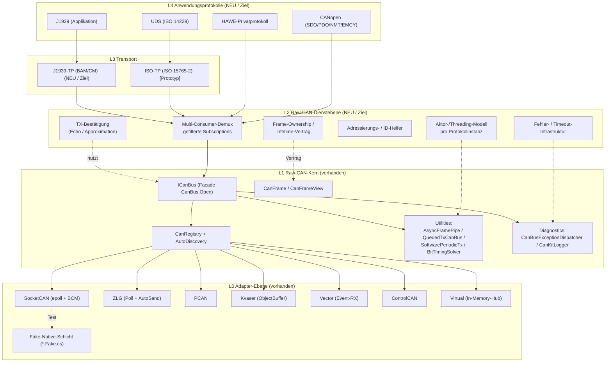
```mermaid
flowchart TB
    subgraph L4["L4 Anwendungsprotokolle  (NEU / Ziel)"]
        UDS["UDS (ISO 14229)"]
        CANopen["CANopen (SDO/PDO/NMT/EMCY)"]
        J1939App["J1939 (Applikation)"]
        HAWE["HAWE-Privatprotokoll"]
    end

    subgraph L3["L3 Transport"]
        IsoTp["ISO-TP (ISO 15765-2)  [Prototyp]"]
        J1939Tp["J1939-TP (BAM/CM)  (NEU / Ziel)"]
    end

    subgraph L2["L2 Raw-CAN-Dienstebene  (NEU / Ziel)"]
        Demux["Multi-Consumer-Demux<br/>gefilterte Subscriptions"]
        Ownership["Frame-Ownership /<br/>Lifetime-Vertrag"]
        TxConfirm["TX-Bestätigung<br/>(Echo / Approximation)"]
        Addr["Adressierungs- / ID-Helfer"]
        Actor["Aktor-/Threading-Modell<br/>pro Protokollinstanz"]
        FaultInfra["Fehler- / Timeout-Infrastruktur"]
    end

    subgraph L1["L1 Raw-CAN-Kern  (vorhanden)"]
        ICanBus["ICanBus (Facade CanBus.Open)"]
        CanFrame["CanFrame / CanFrameView"]
        Registry["CanRegistry + AutoDiscovery"]
        Utils["Utilities:<br/>AsyncFramePipe / QueuedTxCanBus /<br/>SoftwarePeriodicTx / BitTimingSolver"]
        Diag["Diagnostics:<br/>CanBusExceptionDispatcher / CanKitLogger"]
    end

    subgraph L0["L0 Adapter-Ebene  (vorhanden)"]
        SocketCAN["SocketCAN (epoll + BCM)"]
        ZLG["ZLG (Poll + AutoSend)"]
        PCAN["PCAN"]
        Kvaser["Kvaser (ObjectBuffer)"]
        Vector["Vector (Event-RX)"]
        ControlCAN["ControlCAN"]
        Virtual["Virtual (In-Memory-Hub)"]
        Fake["Fake-Native-Schicht (*.Fake.cs)"]
    end

    UDS --> IsoTp
    CANopen --> Demux
    J1939App --> J1939Tp
    HAWE --> Demux
    IsoTp --> Demux
    J1939Tp --> Demux
    Demux --> ICanBus
    Ownership -.Vertrag.-> CanFrame
    TxConfirm -.nutzt.-> ICanBus
    Actor -.-> Utils
    FaultInfra -.-> Diag
    ICanBus --> Registry
    ICanBus --> Utils
    ICanBus --> Diag
    Registry --> SocketCAN
    Registry --> ZLG
    Registry --> PCAN
    Registry --> Kvaser
    Registry --> Vector
    Registry --> ControlCAN
    Registry --> Virtual
    SocketCAN -.Test.-> Fake
```

**Kurzbeschreibung der Top-Level-Bausteine:**

| Baustein | Status | Zweck | Zentrale Schnittstelle | Erfüllt (SRS) |
|----------|--------|-------|------------------------|---------------|
| L0 Adapter | vorhanden | Vendor-Treiber hinter `ICanBus` kapseln, RX-Loop betreiben, TX ausführen. | `ICanBus`, `ITransceiver`, `ICanDevice` | `FR-RAW-ADAPTER-*` |
| L1 Raw-CAN-Kern | vorhanden | Herstellerneutraler Frame-Zugriff, Discovery, Utilities, Diagnostics. | `ICanBus`, `CanBus.Open`, `CanRegistry` | `FR-RAW-*` |
| L2 Raw-CAN-Dienste | NEU | Ein RX-Strom → N unabhängige gefilterte Consumer; Ownership-Vertrag; TX-Confirm; Aktor-Modell. | (neu) `ICanBusService` / `ISubscription` | `FR-RAW-DEMUX-*`, `FR-RAW-OWN-*`, `FR-RAW-TXC-*` |
| L3 Transport | Prototyp (ISO-TP) / MVP (J1939-TP) | Segmentierung/Reassemblierung (ISO-TP), Sessions (J1939-TP, `CanKit.Pro.J1939Tp`: BAM/CM/DT, T1..T4/Tr/Th, parallele Sessions über gemeinsamen `ICanBusService`). | `IIsoTpChannel`, `IIsoTpScheduler`, `IJ1939TpChannel` | `FR-TP-*` |
| L4 Anwendungsprotokolle | NEU | Diagnose-/Applikationssemantik auf L3/L2. | (neu) protokollspezifisch | `FR-UDS-*`, `FR-CO-*`, `FR-J1939-*`, `FR-HAWE-*` |

## 5.2 Ebene 2 – Zoom L1 (Raw-CAN-Kern, vorhanden)

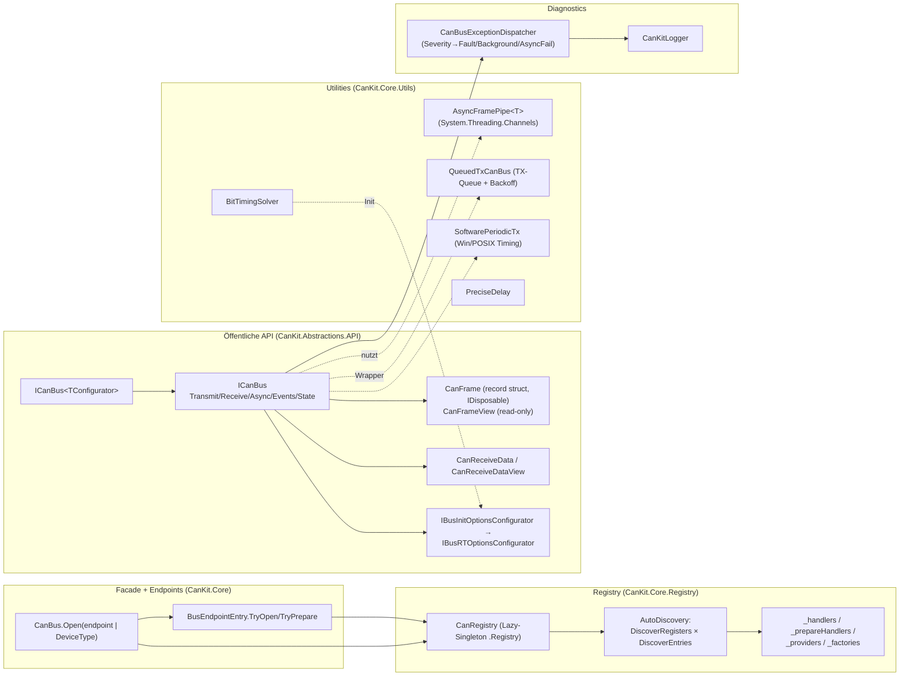
```mermaid
flowchart LR
    subgraph API["Öffentliche API (CanKit.Abstractions.API)"]
        ICanBus["ICanBus<br/>Transmit/Receive/Async/Events/State"]
        ICanBusG["ICanBus&lt;TConfigurator&gt;"]
        Frame["CanFrame (record struct, IDisposable)<br/>CanFrameView (read-only)"]
        RxData["CanReceiveData / CanReceiveDataView"]
        Opts["IBusInitOptionsConfigurator →<br/>IBusRTOptionsConfigurator"]
    end

    subgraph Facade["Facade + Endpoints (CanKit.Core)"]
        CanBus["CanBus.Open(endpoint | DeviceType)"]
        EpEntry["BusEndpointEntry.TryOpen/TryPrepare"]
    end

    subgraph Reg["Registry (CanKit.Core.Registry)"]
        CanRegistry["CanRegistry (Lazy-Singleton .Registry)"]
        AutoDisc["AutoDiscovery:<br/>DiscoverRegisters × DiscoverEntries"]
        Handlers["_handlers / _prepareHandlers /<br/>_providers / _factories"]
    end

    subgraph UtilsG["Utilities (CanKit.Core.Utils)"]
        Pipe["AsyncFramePipe&lt;T&gt;<br/>(System.Threading.Channels)"]
        QTx["QueuedTxCanBus (TX-Queue + Backoff)"]
        SwTx["SoftwarePeriodicTx (Win/POSIX Timing)"]
        Delay["PreciseDelay"]
        BitSolver["BitTimingSolver"]
    end

    subgraph DiagG["Diagnostics"]
        Dispatcher["CanBusExceptionDispatcher<br/>(Severity→Fault/Background/AsyncFail)"]
        Logger["CanKitLogger"]
    end

    ICanBus --> Opts
    ICanBusG --> ICanBus
    ICanBus --> Frame
    ICanBus --> RxData
    CanBus --> EpEntry --> CanRegistry
    CanBus --> CanRegistry
    CanRegistry --> AutoDisc --> Handlers
    ICanBus -.nutzt.-> Pipe
    ICanBus -.Wrapper.-> QTx
    ICanBus -.-> SwTx
    ICanBus --> Dispatcher --> Logger
    BitSolver -.Init.-> Opts
```

**Bausteine L1 (Auswahl):**

| Baustein | Zweck | Schnittstelle (verifiziert) | Erfüllt |
|----------|-------|------------------------------|---------|
| `ICanBus` | Herstellerneutraler Raw-CAN-Zugriff. | `Transmit(Span/Array/Enumerable/ArraySegment/in single)`, `TransmitAsync`, `Receive/ReceiveAsync/GetFramesAsync`, `TransmitPeriodic`, `Reset/ClearBuffer`, `BusState`, `ErrorCounters()`, `BusUsage()`, `NativeHandle`; Events `FrameReceived`(obsolet), `FrameObserved`, `ErrorFrameReceived`, `BackgroundExceptionOccurred`, `FaultOccurred`. | `FR-RAW-BUS-*` |
| `CanFrame` | Wert-Typ für Frames, Classic+FD-Factories, optionales Owner-Backing. | `readonly record struct`, `Classic(...)`/`Fd(...)`/`Create(...)`, `Data:ReadOnlyMemory<byte>`, `Flags`, `Dlc`, `Dispose()`. | `FR-RAW-FRAME-*` |
| `CanFrameView` | Read-only-Projektion für Beobachter (kein Ownership). | `readonly record struct` mit `ID/FrameKind/Data/Flags`. | `FR-RAW-OBS-*` |
| `CanRegistry` | Discovery + Auflösung von Providern/Factories/Endpoints. | `Registry` (Lazy-Singleton), `Resolve(DeviceType)`, `Factory(id)`, `TryOpenEndPoint`, `EnumerateEndPoints`. | `FR-RAW-DISC-*` |
| `AsyncFramePipe<T>` | Entkopplung RX-Producer (Loop) ↔ async-Consumer. | `Publish`, `ReceiveBatchAsync`, `ReadAllAsync`, `ExceptionOccured`. | `FR-RAW-ASYNC-*` |
| `QueuedTxCanBus` | Optionaler TX-Queue-Wrapper mit Backoff. | Erweiterung `ICanBus.WithQueuedTx()`. | `FR-RAW-TXQ-*` |
| `CanBusExceptionDispatcher` | Zentrale Fehlerklassifikation → Fault/Background/Async-Fail. | `Report(exception, source, severity?)`. | `FR-RAW-ERR-*` |

## 5.3 Ebene 2 – Zoom L2 (Raw-CAN-Dienstebene, NEU / Ziel)

L2 schließt die vier zentralen Architektur-Lücken. **Alle Bausteine hier sind Ziel-Architektur.**

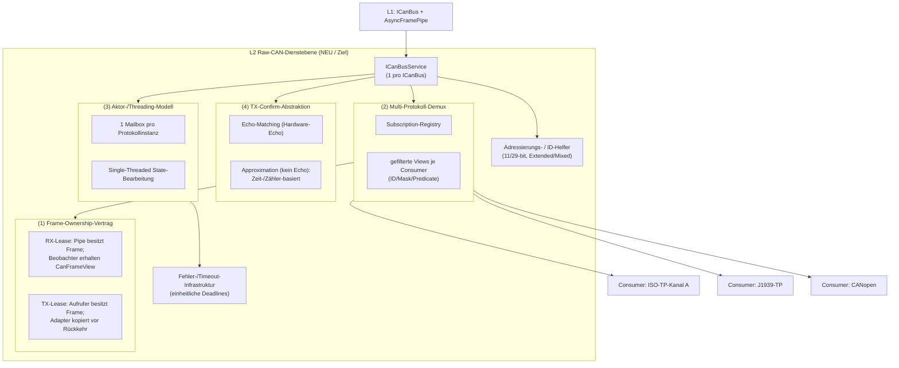
```mermaid
flowchart TB
    subgraph L2["L2 Raw-CAN-Dienstebene  (NEU / Ziel)"]
        BusService["ICanBusService<br/>(1 pro ICanBus)"]
        subgraph DemuxBox["(2) Multi-Protokoll-Demux"]
            SubReg["Subscription-Registry"]
            Filter["gefilterte Views je Consumer<br/>(ID/Mask/Predicate)"]
        end
        subgraph OwnBox["(1) Frame-Ownership-Vertrag"]
            LeaseRx["RX-Lease: Pipe besitzt Frame;<br/>Beobachter erhalten CanFrameView"]
            LeaseTx["TX-Lease: Aufrufer besitzt Frame;<br/>Adapter kopiert vor Rückkehr"]
        end
        subgraph TxcBox["(4) TX-Confirm-Abstraktion"]
            EchoMatch["Echo-Matching (Hardware-Echo)"]
            Approx["Approximation (kein Echo):<br/>Zeit-/Zähler-basiert"]
        end
        AddrBox["Adressierungs- / ID-Helfer<br/>(11/29-bit, Extended/Mixed)"]
        subgraph ActorBox["(3) Aktor-/Threading-Modell"]
            Mailbox["1 Mailbox pro Protokollinstanz"]
            SingleLoop["Single-Threaded State-Bearbeitung"]
        end
        TimeoutBox["Fehler-/Timeout-Infrastruktur<br/>(einheitliche Deadlines)"]
    end

    L1Bus["L1: ICanBus + AsyncFramePipe"] --> BusService
    BusService --> DemuxBox
    DemuxBox --> OwnBox
    BusService --> TxcBox
    BusService --> AddrBox
    BusService --> ActorBox
    ActorBox --> TimeoutBox
    DemuxBox --> C1["Consumer: ISO-TP-Kanal A"]
    DemuxBox --> C2["Consumer: J1939-TP"]
    DemuxBox --> C3["Consumer: CANopen"]
```

| L2-Baustein | Lücke | Zweck | vorgesehene Schnittstelle | Erfüllt |
|-------------|-------|-------|----------------------------|---------|
| `ICanBusService` | – | Ein Dienst-Objekt pro `ICanBus`; hält Subscriptions, TX-Confirm, Aktoren. | `Subscribe(filter) → ISubscription`, `SendConfirmed(frame) → Task<TxConfirmation>` | `FR-RAW-SVC-*` |
| Multi-Protokoll-Demux | (2) | Ein RX-Strom → N unabhängige gefilterte Consumer, **ohne** konkurrierendes `ReceiveAsync`. **Umgesetzt** im neuen Paket `CanKit.Pro.RawCan` (`ICanBusService`/`CanBusService` + `ISubscription`): je Subscription ein eigener bounded Drop-Oldest-Channel (FR-RAW-011), Fast-Path `CanIdFilter` (ID-Range/Maske) neben generischem `Func<CanFrameView,bool>` (FR-RAW-010/013), deterministisches Dispose (FR-RAW-012). Baut ausschließlich auf `ICanBus.FrameObserved`, kein Adapter-Eingriff. | `ICanBusService.Subscribe(filter) → ISubscription { IAsyncEnumerable<CanFrameView> Frames; }` | `FR-RAW-010..013` |
| Frame-Ownership-Vertrag | (1) | Verbindliche Lease-Regeln (siehe 8.1); verhindert Use-after-free/Double-Dispose. **Kernmechanik umgesetzt** (`OwnMemory`-Fix, `CanFrame.Duplicate`, Virtual-Hub-Broadcast per Kopie); ausstehend: TX-Lease für übrige L0-Adapter/ISO-TP-Scheduler. | Vertragsdoku + `OwnMemory`-Fix (Review §1.5) | `FR-RAW-OWN-*` |
| TX-Confirm | (4) | Einheitliche „gesendet"-Bestätigung, egal ob Hardware-Echo vorhanden. **Umgesetzt** in `CanKit.Pro.RawCan` (`ICanBusService.SendConfirmed`): FIFO-Echo-Matching je (ID, Payload) für gleichzeitige inhaltsgleiche Sendevorgänge (FR-RAW-031), dokumentierte Treiber-Akzeptanz-Approximation ohne Echo (FR-RAW-032), beobachtbare Fehlschläge statt Hängen bei Timeout/BusOff/Ablehnung (FR-RAW-033), konfigurierbarer Timeout je Aufruf (FR-RAW-034). | `TxConfirmation { Confirmed; Timestamp; IsApproximated; FailureReason; }` | `FR-RAW-030..034` |
| Adressierungs-Helfer | – | 11/29-bit, Extended/Mixed/NormalFixed (bislang nur als Einzelfall in `IsoTpEndpoint` vorhanden). **Umgesetzt** als eigenständiges, abhängigkeitsfreies Paket `CanKit.Pro.Addressing`: validierte 11-/29-Bit-ID-Prüfung (`CanIdRange`), allgemeine J1939-PGN/Priorität/PDU-Format/Quelladresse-Komposition/-Dekomposition (`J1939Id`/`J1939Fields`, FR-RAW-040), J1939-NAME-Feldzugriff und Address-Claim-Prioritätsvergleich (`J1939Name`) sowie PGN-Klassifikatoren für Request/TP/Address-Claim/BAM-Grundlagen (`J1939Pgn`) als Vorarbeit für FR-J1939-001/003 — verallgemeinert die zuvor auf eine feste Diagnose-PGN beschränkte 29-Bit-Konstruktion aus `IsoTpEndpoint.CreateNormalFixed`. Zusätzlich `CanIdFilter.Overlaps` sowie `ICanBusService.FindOverlappingFilterSubscriptions()` in `CanKit.Pro.RawCan` zur Erkennung überlappender Subscription-Filter (FR-RAW-041, Should). | ID-Bau/-Zerlegung, PGN/Prio/NAME-Helfer | `FR-RAW-ADDR-*` |
| Aktor-/Threading-Modell | (3) | Genau ein Bearbeitungs-Thread/Mailbox pro Protokollinstanz; kein geteilter mutabler State. **Umgesetzt** als eigenständiges, abhängigkeitsfreies Paket `CanKit.Pro.Actor` (siehe ADR-6): ereignisgetriebener Loop (kein Busy-Loop, FR-RAW-022), je Instanz wählbarer Ausführungskontext (`ActorExecutionMode`: `DedicatedThread`/`ThreadPool`/`SynchronizationContext`, FR-RAW-024), `BackgroundExceptionOccurred` als einziger Kanal für Hintergrundfehler (FR-RAW-023). Vom ISO-TP-Prototyp noch nicht genutzt. | `IProtocolActor { Post(msg); PostAsync(msg); Schedule(delay, cb); }` | `FR-RAW-ACTOR-*` |
| Fehler-/Timeout-Infrastruktur | – | Einheitliche Deadline-Verwaltung (ersetzt verstreute ISO-TP-`Deadline`s) und gepushte Bus-Fehlerzustände. **Umgesetzt** als eigenständiges Paket `CanKit.Pro.Reliability` (siehe ADR-11), aufbauend auf `CanKit.Pro.Actor`: `IDeadlineScheduler`/`DeadlineScheduler`/`Deadline` ist eine wiederverwendbare Deadline-Primitive, deren Ablauf über `IProtocolActor.Schedule` auf dem Aktor-Loop tatsächlich eingeplant, geprüft und gemeldet wird — behebt die Klasse „Deadlines werden gepflegt, aber nie geprüft" (Review §1.1 Punkt 10, FR-RAW-050); die Pending→{Expired\|Completed\|Cancelled}-Auflösung ist per `Interlocked`-CAS genau einmal entscheidbar, Ausnahmen aus `onExpired` laufen über den bestehenden `BackgroundExceptionOccurred`-Kanal (kein zweiter Fehlerkanal). `BusStateMonitor`/`BusStateChangedEventArgs`/`BusStateExtensions` pusht `ICanBus.BusState`-Übergänge (ErrWarning/ErrPassive/BusOff sowie Erholung) an Protokollinstanzen — zuverlässig über einen selbst-rearmenden Poll auf dem Aktor-`Schedule` (Standard 50 ms) statt eines freilaufenden Timers, ergänzt um `ErrorFrameReceived`/`FaultOccurred` als Latenz-Hinweise (FR-RAW-051). FR-RAW-052 (reservierte/ungültige Protokollwerte) ist bewusst **zurückgestellt** und dem ISO-TP-Codec-Fix FR-TP-007 zugeordnet, nicht als generische L2-Primitive gebaut. | `IDeadlineScheduler`, `DeadlineScheduler`/`Deadline`, `BusStateMonitor`, `BusStateExtensions` | `FR-RAW-050..051` |

## 5.4 Ebene 2/3 – Zoom L3: ISO-TP-Interna (Prototyp – Klassendiagramm)

Das folgende Klassendiagramm bildet den **Ist-Zustand** des ISO-TP-Prototyps ab
(verifiziert an den Quelldateien). Die markierten Defekte sind in Abschnitt 11 gelistet.

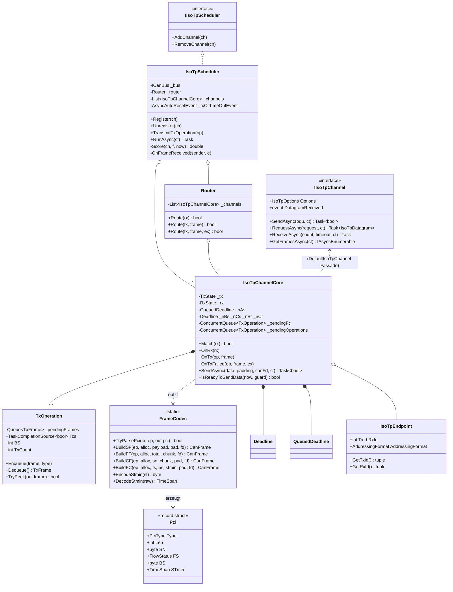
```mermaid
classDiagram
    class IIsoTpChannel {
        <<interface>>
        +IsoTpOptions Options
        +event DatagramReceived
        +SendAsync(pdu, ct) Task~bool~
        +RequestAsync(request, ct) Task~IsoTpDatagram~
        +ReceiveAsync(count, timeout, ct) Task
        +GetFramesAsync(ct) IAsyncEnumerable
    }
    class IIsoTpScheduler {
        <<interface>>
        +AddChannel(ch)
        +RemoveChannel(ch)
    }
    class IsoTpScheduler {
        -ICanBus _bus
        -Router _router
        -List~IsoTpChannelCore~ _channels
        -AsyncAutoResetEvent _txOrTimeOutEvent
        +Register(ch)
        +Unregister(ch)
        +TransmitTxOperation(op)
        +RunAsync(ct) Task
        -Score(ch, f, now) double
        -OnFrameReceived(sender, e)
    }
    class Router {
        -List~IsoTpChannelCore~ _channels
        +Route(rx) bool
        +Route(tx, frame) bool
        +Route(tx, frame, ex) bool
    }
    class IsoTpChannelCore {
        -TxState _tx
        -RxState _rx
        -QueuedDeadline _nAs
        -Deadline _nBs _nCs _nBr _nCr
        -ConcurrentQueue~TxOperation~ _pendingFc
        -ConcurrentQueue~TxOperation~ _pendingOperations
        +Match(rx) bool
        +OnRx(rx)
        +OnTx(op, frame)
        +OnTxFailed(op, frame, ex)
        +SendAsync(data, padding, canFd, ct) Task~bool~
        +IsReadyToSendData(now, guard) bool
    }
    class TxOperation {
        -Queue~TxFrame~ _pendingFrames
        +TaskCompletionSource~bool~ Tcs
        +int BS
        +int TxCount
        +Enqueue(frame, type)
        +Dequeue() TxFrame
        +TryPeek(out frame) bool
    }
    class FrameCodec {
        <<static>>
        +TryParsePci(rx, ep, out pci) bool
        +BuildSF(ep, alloc, payload, pad, fd) CanFrame
        +BuildFF(ep, alloc, total, chunk, fd) CanFrame
        +BuildCF(ep, alloc, sn, chunk, pad, fd) CanFrame
        +BuildFC(ep, alloc, fs, bs, stmin, pad, fd) CanFrame
        +EncodeStmin(st) byte
        +DecodeStmin(raw) TimeSpan
    }
    class Pci {
        <<record struct>>
        +PciType Type
        +int Len
        +byte SN
        +FlowStatus FS
        +byte BS
        +TimeSpan STmin
    }
    class Deadline
    class QueuedDeadline
    class IsoTpEndpoint {
        +int TxId RxId
        +AddressingFormat AddressingFormat
        +GetTxId() tuple
        +GetRxId() tuple
    }

    IIsoTpScheduler <|.. IsoTpScheduler
    IsoTpScheduler o-- Router
    IsoTpScheduler o-- "*" IsoTpChannelCore
    Router o-- "*" IsoTpChannelCore
    IsoTpChannelCore *-- "*" TxOperation
    IsoTpChannelCore ..> FrameCodec : nutzt
    IsoTpChannelCore o-- IsoTpEndpoint
    IsoTpChannelCore *-- Deadline
    IsoTpChannelCore *-- QueuedDeadline
    FrameCodec ..> Pci : erzeugt
    IIsoTpChannel <.. IsoTpChannelCore : (DefaultIsoTpChannel Fassade)
```

**Bausteine L3/ISO-TP (Ist, verifiziert):**

| Baustein | Zweck | Zustände / Kernmethoden | Status |
|----------|-------|--------------------------|--------|
| `IsoTpChannelCore` | TX/RX-State-Machine je Endpoint. | TX: `Idle/WaitFc/SendCf/WaitFcAfterBlock/Failed`; RX: `Idle/RecvCf`. `OnRx/OnTx/SendAsync`. | Prototyp, defekt (§11). |
| `IsoTpScheduler` | Kanal-Auswahl/Scoring, FC-Priorität, BusGuard, Echo-Routing. | `RunAsync` (Busy-Loop!), `TransmitTxOperation`, `Score` (konstant). | Prototyp, defekt. |
| `Router` | Ordnet RX-Frames und TX-Echo den Kanälen zu (`Match`). | `Route(rx)`, `Route(tx,frame[,ex])`. | Prototyp (List ohne Sync). |
| `FrameCodec` | Bau/Parsing von SF/FF/CF/FC + STmin-En/Decode. | `BuildSF/FF/CF/FC`, `TryParsePci`, `Encode/DecodeStmin`. | Prototyp, mehrere Bugs. |
| `Deadline`/`QueuedDeadline` | N_As/N_Bs/N_Cs/N_Ar/N_Br/N_Cr. | Gepflegt, aber nie ausgewertet. | Prototyp. |

---

# 6. Laufzeitsicht

## 6.1 (a) `CanBus.Open` inkl. Registry-Discovery (Ist)

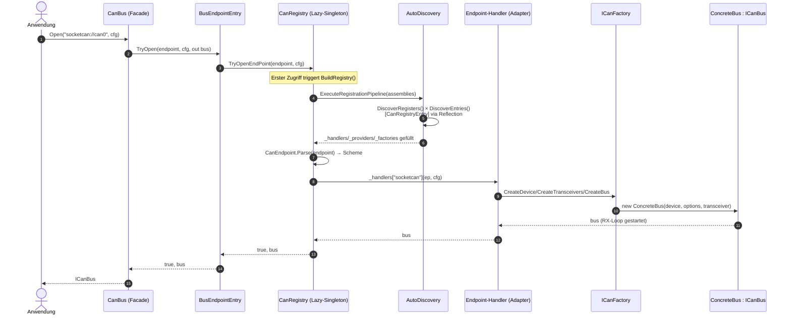
```mermaid
sequenceDiagram
    autonumber
    actor App as Anwendung
    participant Facade as CanBus (Facade)
    participant Entry as BusEndpointEntry
    participant Reg as CanRegistry (Lazy-Singleton)
    participant Disc as AutoDiscovery
    participant Handler as Endpoint-Handler (Adapter)
    participant Factory as ICanFactory
    participant Bus as ConcreteBus : ICanBus

    App->>Facade: Open("socketcan://can0", cfg)
    Facade->>Entry: TryOpen(endpoint, cfg, out bus)
    Entry->>Reg: TryOpenEndPoint(endpoint, cfg)
    Note over Reg: Erster Zugriff triggert BuildRegistry()
    Reg->>Disc: ExecuteRegistrationPipeline(assemblies)
    Disc->>Disc: DiscoverRegisters() × DiscoverEntries()<br/>[CanRegistryEntry] via Reflection
    Disc-->>Reg: _handlers/_providers/_factories gefüllt
    Reg->>Reg: CanEndpoint.Parse(endpoint) → Scheme
    Reg->>Handler: _handlers["socketcan"](ep, cfg)
    Handler->>Factory: CreateDevice/CreateTransceivers/CreateBus
    Factory->>Bus: new ConcreteBus(device, options, transceiver)
    Bus-->>Handler: bus (RX-Loop gestartet)
    Handler-->>Reg: bus
    Reg-->>Entry: true, bus
    Entry-->>Facade: true, bus
    Facade-->>App: ICanBus
```

## 6.2 (b) RX-Pfad: Adapter → Pipe → Demux (L2) → mehrere Consumer

Der obere Teil ist **Ist** (Adapter-RX-Loop, Events, `AsyncFramePipe`), der Demux-Teil ist **Ziel (L2)**.

```mermaid
sequenceDiagram
    autonumber
    participant HW as CAN-Hardware / Treiber
    participant Loop as RX-Loop (LongRunning-Task)<br/>epoll/Poll/Event  [Ist]
    participant Ev as Event-Subscriber<br/>FrameObserved (CanFrameView)  [Ist]
    participant Pipe as AsyncFramePipe (Channels)  [Ist]
    participant Demux as L2 Demux  [Ziel]
    participant IsoTp as Consumer: ISO-TP
    participant J1939 as Consumer: J1939-TP
    participant CANopen as Consumer: CANopen

    HW-->>Loop: Frame(s) verfügbar
    Loop->>Loop: transceiver.Receive(batch)
    alt Ist-Zustand (heute)
        Loop->>Ev: FrameObserved(view)
        Loop->>Pipe: Publish(CanReceiveData)
        Note over Ev,Pipe: Ownership heute uneinheitlich →<br/>Use-after-free-Risiko (§11)
    else Ziel-Zustand (mit L2)
        Loop->>Pipe: Publish(RX-Lease)
        Pipe->>Demux: Frame (Pipe besitzt Frame)
        Demux->>Demux: Match je Subscription (ID/Mask/Predicate)
        Demux-->>IsoTp: CanFrameView (read-only)
        Demux-->>J1939: CanFrameView (read-only)
        Demux-->>CANopen: CanFrameView (read-only)
        Note over Demux: Frame wird erst nach<br/>letztem Consumer freigegeben
    end
```

## 6.3 (c) TX-Pfad inkl. TX-Confirm (Ziel L2 über Ist-L1)

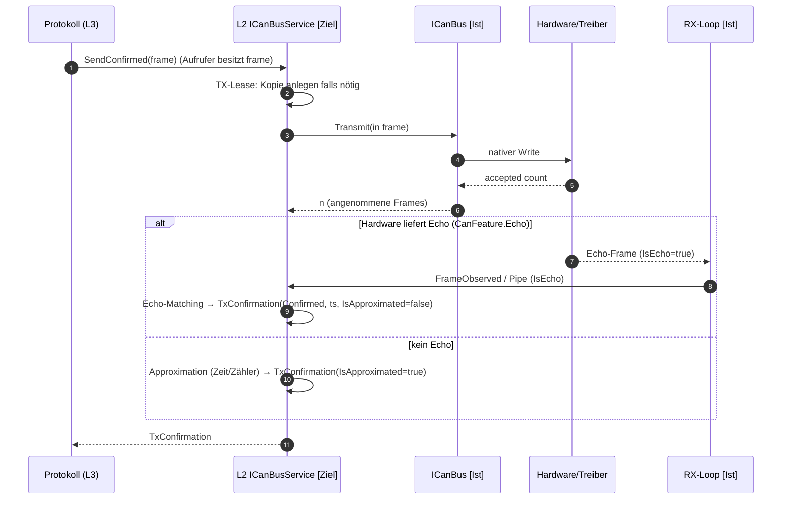
```mermaid
sequenceDiagram
    autonumber
    participant Proto as Protokoll (L3)
    participant Svc as L2 ICanBusService  [Ziel]
    participant Bus as ICanBus  [Ist]
    participant HW as Hardware/Treiber
    participant Rx as RX-Loop  [Ist]

    Proto->>Svc: SendConfirmed(frame)  (Aufrufer besitzt frame)
    Svc->>Svc: TX-Lease: Kopie anlegen falls nötig
    Svc->>Bus: Transmit(in frame)
    Bus->>HW: nativer Write
    HW-->>Bus: accepted count
    Bus-->>Svc: n (angenommene Frames)
    alt Hardware liefert Echo (CanFeature.Echo)
        HW-->>Rx: Echo-Frame (IsEcho=true)
        Rx->>Svc: FrameObserved / Pipe (IsEcho)
        Svc->>Svc: Echo-Matching → TxConfirmation(Confirmed, ts, IsApproximated=false)
    else kein Echo
        Svc->>Svc: Approximation (Zeit/Zähler) → TxConfirmation(IsApproximated=true)
    end
    Svc-->>Proto: TxConfirmation
```

## 6.4 (d) ISO-TP Multi-Frame-Übertragung (FF → FC/CTS → CF… → Datagram)

Ziel-Ablauf gemäß ISO 15765-2 (der Prototyp implementiert dies noch nicht korrekt, §11):

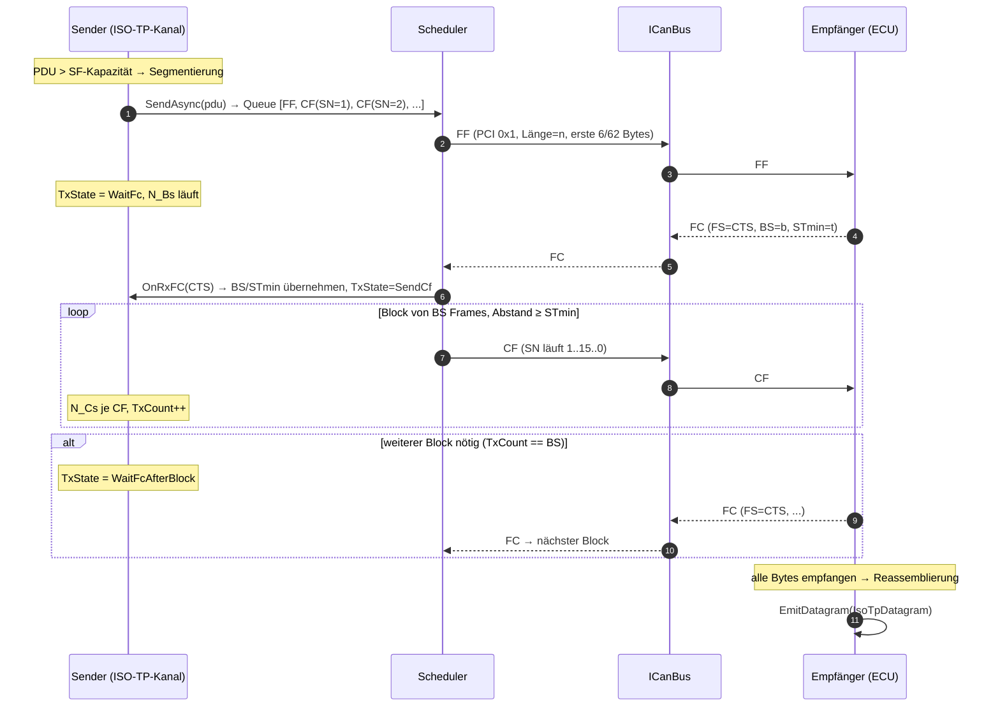
```mermaid
sequenceDiagram
    autonumber
    participant S as Sender (ISO-TP-Kanal)
    participant Sched as Scheduler
    participant Bus as ICanBus
    participant R as Empfänger (ECU)

    Note over S: PDU > SF-Kapazität → Segmentierung
    S->>Sched: SendAsync(pdu) → Queue [FF, CF(SN=1), CF(SN=2), ...]
    Sched->>Bus: FF (PCI 0x1, Länge=n, erste 6/62 Bytes)
    Bus->>R: FF
    Note over S: TxState = WaitFc, N_Bs läuft
    R-->>Bus: FC (FS=CTS, BS=b, STmin=t)
    Bus-->>Sched: FC
    Sched->>S: OnRxFC(CTS) → BS/STmin übernehmen, TxState=SendCf
    loop Block von BS Frames, Abstand ≥ STmin
        Sched->>Bus: CF (SN läuft 1..15..0)
        Bus->>R: CF
        Note over S: N_Cs je CF, TxCount++
    end
    alt weiterer Block nötig (TxCount == BS)
        Note over S: TxState = WaitFcAfterBlock
        R-->>Bus: FC (FS=CTS, ...)
        Bus-->>Sched: FC → nächster Block
    end
    Note over R: alle Bytes empfangen → Reassemblierung
    R->>R: EmitDatagram(IsoTpDatagram)
```

## 6.5 (e) UDS-Request/Response mit ResponsePending (0x78) über ISO-TP (Ziel L4)

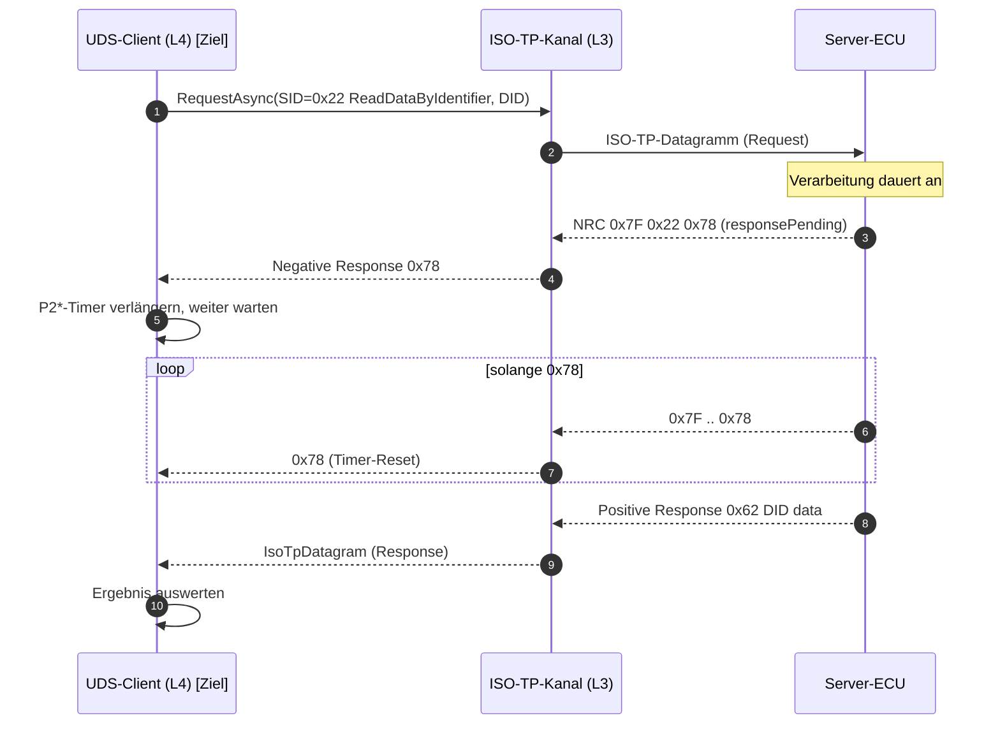
```mermaid
sequenceDiagram
    autonumber
    participant Client as UDS-Client (L4)  [Ziel]
    participant IsoTp as ISO-TP-Kanal (L3)
    participant ECU as Server-ECU

    Client->>IsoTp: RequestAsync(SID=0x22 ReadDataByIdentifier, DID)
    IsoTp->>ECU: ISO-TP-Datagramm (Request)
    Note over ECU: Verarbeitung dauert an
    ECU-->>IsoTp: NRC 0x7F 0x22 0x78 (responsePending)
    IsoTp-->>Client: Negative Response 0x78
    Client->>Client: P2*-Timer verlängern, weiter warten
    loop solange 0x78
        ECU-->>IsoTp: 0x7F .. 0x78
        IsoTp-->>Client: 0x78 (Timer-Reset)
    end
    ECU-->>IsoTp: Positive Response 0x62 DID data
    IsoTp-->>Client: IsoTpDatagram (Response)
    Client->>Client: Ergebnis auswerten
```

## 6.6 (f) J1939 TP.CM-Session (Ziel L3)

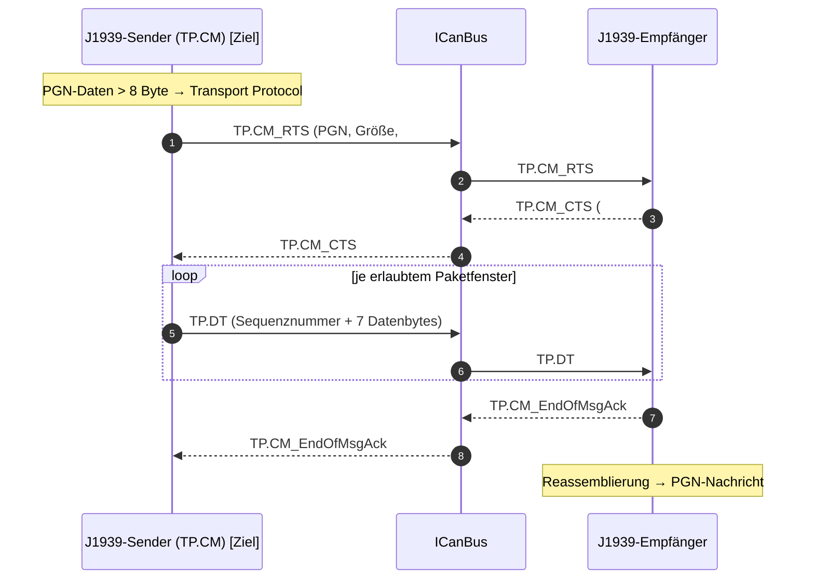
```mermaid
sequenceDiagram
    autonumber
    participant TX as J1939-Sender (TP.CM)  [Ziel]
    participant Bus as ICanBus
    participant RX as J1939-Empfänger

    Note over TX: PGN-Daten > 8 Byte → Transport Protocol
    TX->>Bus: TP.CM_RTS (PGN, Größe, #Pakete)
    Bus->>RX: TP.CM_RTS
    RX-->>Bus: TP.CM_CTS (#Pakete, nächste Sequenz)
    Bus-->>TX: TP.CM_CTS
    loop je erlaubtem Paketfenster
        TX->>Bus: TP.DT (Sequenznummer + 7 Datenbytes)
        Bus->>RX: TP.DT
    end
    RX-->>Bus: TP.CM_EndOfMsgAck
    Bus-->>TX: TP.CM_EndOfMsgAck
    Note over RX: Reassemblierung → PGN-Nachricht
```

## 6.7 ISO-TP-State-Machine (Ist-Prototyp)

**TX-State-Machine** (`TxState`, verifiziert in `IsoTpChannelCore`):

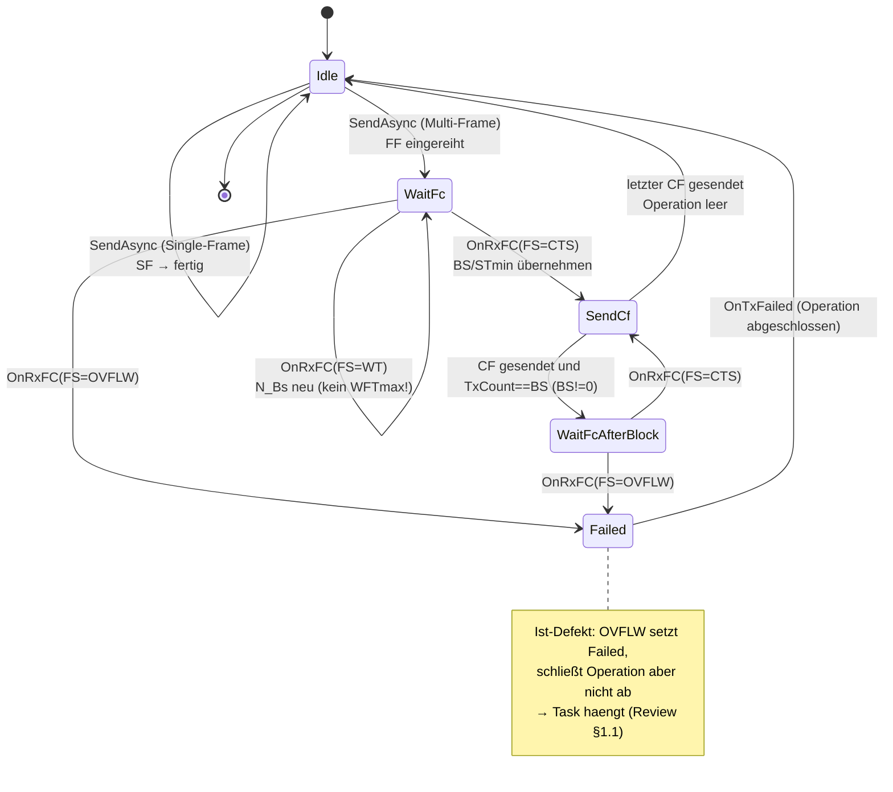
```mermaid
stateDiagram-v2
    [*] --> Idle
    Idle --> WaitFc : SendAsync (Multi-Frame)<br/>FF eingereiht
    Idle --> Idle : SendAsync (Single-Frame)<br/>SF → fertig
    WaitFc --> SendCf : OnRxFC(FS=CTS)<br/>BS/STmin übernehmen
    WaitFc --> WaitFc : OnRxFC(FS=WT)<br/>N_Bs neu (kein WFTmax!)
    WaitFc --> Failed : OnRxFC(FS=OVFLW)
    SendCf --> WaitFcAfterBlock : CF gesendet und TxCount==BS (BS!=0)
    SendCf --> Idle : letzter CF gesendet<br/>Operation leer
    WaitFcAfterBlock --> SendCf : OnRxFC(FS=CTS)
    WaitFcAfterBlock --> Failed : OnRxFC(FS=OVFLW)
    Failed --> Idle : OnTxFailed (Operation abgeschlossen)
    Idle --> [*]

    note right of Failed
        Ist-Defekt: OVFLW setzt Failed,
        schließt Operation aber nicht ab
        → Task haengt (Review §1.1)
    end note
```

**RX-State-Machine** (`RxState`):

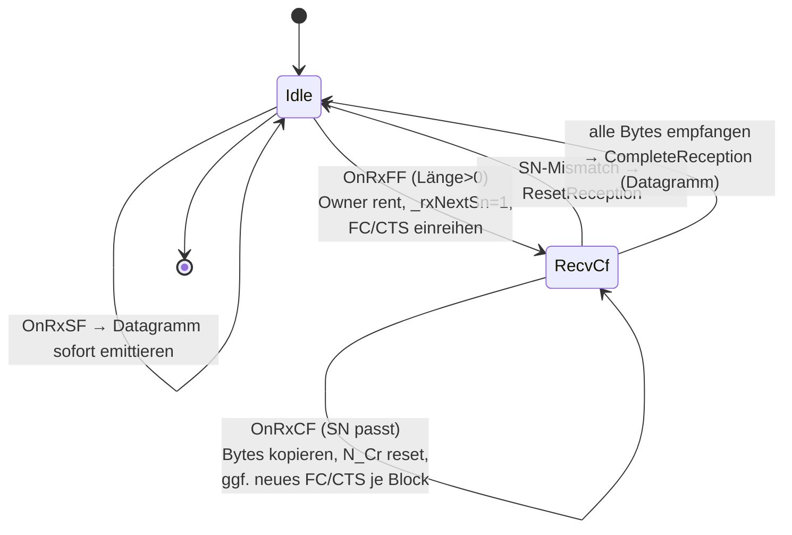
```mermaid
stateDiagram-v2
    [*] --> Idle
    Idle --> Idle : OnRxSF → Datagramm sofort emittieren
    Idle --> RecvCf : OnRxFF (Länge>0)<br/>Owner rent, _rxNextSn=1,<br/>FC/CTS einreihen
    RecvCf --> RecvCf : OnRxCF (SN passt)<br/>Bytes kopieren, N_Cr reset,<br/>ggf. neues FC/CTS je Block
    RecvCf --> Idle : SN-Mismatch → ResetReception
    RecvCf --> Idle : alle Bytes empfangen<br/>→ CompleteReception (Datagramm)
    Idle --> [*]
```

---

# 7. Verteilungssicht

CanKit ist eine **In-Process-Bibliothek** (kein eigener Prozess/Dienst). Die Verteilung
betrifft die Kombination aus TFM, Betriebssystem, nativem Treiber und Hardware.

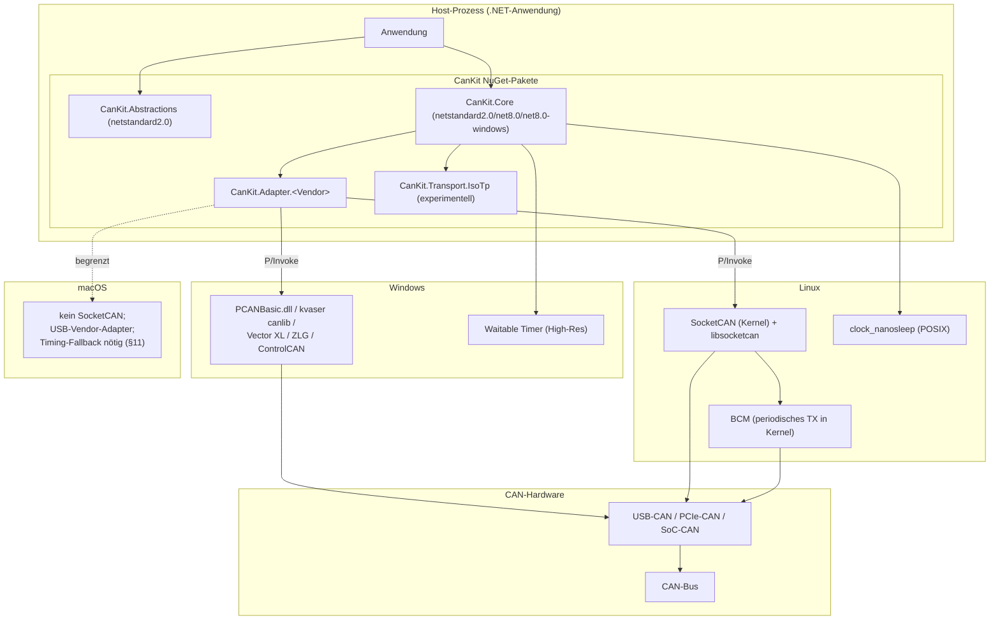
```mermaid
flowchart TB
    subgraph HostProc["Host-Prozess (.NET-Anwendung)"]
        AppDll["Anwendung"]
        subgraph Nuget["CanKit NuGet-Pakete"]
            Abstr["CanKit.Abstractions (netstandard2.0)"]
            Core["CanKit.Core (netstandard2.0/net8.0/net8.0-windows)"]
            AdapterDll["CanKit.Adapter.&lt;Vendor&gt;"]
            IsoTpDll["CanKit.Transport.IsoTp (experimentell)"]
        end
    end

    subgraph Win["Windows"]
        WinDrv["PCANBasic.dll / kvaser canlib /<br/>Vector XL / ZLG / ControlCAN"]
        WinTimer["Waitable Timer (High-Res)"]
    end
    subgraph Linux["Linux"]
        SockDrv["SocketCAN (Kernel) + libsocketcan"]
        Bcm["BCM (periodisches TX in Kernel)"]
        PosixTimer["clock_nanosleep (POSIX)"]
    end
    subgraph Mac["macOS"]
        MacNote["kein SocketCAN;<br/>USB-Vendor-Adapter;<br/>Timing-Fallback nötig (§11)"]
    end

    subgraph HWlayer["CAN-Hardware"]
        UsbIf["USB-CAN / PCIe-CAN / SoC-CAN"]
        CanBus2["CAN-Bus"]
    end

    AppDll --> Abstr
    AppDll --> Core
    Core --> AdapterDll
    Core --> IsoTpDll
    AdapterDll -->|"P/Invoke"| WinDrv
    AdapterDll -->|"P/Invoke"| SockDrv
    AdapterDll -.begrenzt.-> MacNote
    Core --> WinTimer
    Core --> PosixTimer
    SockDrv --> Bcm
    WinDrv --> UsbIf
    SockDrv --> UsbIf
    Bcm --> UsbIf
    UsbIf --> CanBus2
```

**TFM-/Plattform-abhängige Pfade:**

| Aspekt | Windows (`net8.0-windows`) | Linux (`net8.0`) | netstandard2.0 (.NET Framework) | macOS |
|--------|-----------------------------|-------------------|----------------------------------|-------|
| Bevorzugter Adapter | PCAN/Kvaser/Vector/ZLG/ControlCAN | SocketCAN | vendor-abhängig | USB-Vendor-Adapter |
| Periodisches TX | Software (Waitable Timer) / Vendor-AutoSend | Hardware-BCM oder Software | Software | Software (Fallback fehlt, §11) |
| High-Res-Delay | `Win_PreWait` (Waitable/Spin) | `clock_nanosleep` | plattformabhängig | **Busy-Loop-Bug** (§11) |
| `Queue.TryPeek` | vorhanden | vorhanden | via `#if`-Weiche (heute invertiert, §11) | vorhanden |

---

# 8. Querschnittliche Konzepte

## 8.1 Frame-Ownership / Lifetime-Vertrag (zentral!)

`CanFrame` ist ein `readonly record struct` mit optionalem `IMemoryOwner<byte>`-Backing
und `IDisposable`. Der Wert wird kopiert, über Events geteilt, durch die `AsyncFramePipe`
gereicht und im Virtual-Hub an N Empfänger gebroadcastet. Ohne verbindlichen Vertrag
entstehen **Use-after-free** und **Double-Dispose** (Review §1.5, §2.1).

**Ist-Zustand (behoben, FR-RAW-001/002/004):**
- `CanFrame.Dispose()` respektiert das `OwnMemory`-Flag und gibt den Owner nur frei, wenn
  die Frame-Instanz laut Ownership-Vertrag Eigentümerin ist (vormals Review §1.5,
  `CanFrame.cs:370`; behoben).
- `CanFrame.Duplicate(IBufferAllocator)` (neu) erzeugt eine unabhängig lebensfähige Kopie mit
  eigenem gemieteten Puffer, deren `Dispose()` vom Original entkoppelt ist — die konkrete
  Primitive, mit der Multi-Consumer-Verteiler eigenständige RX-Leases herstellen.
- `VirtualBusHub.Broadcast` reicht nicht mehr den geteilten Sender-Frame weiter, sondern
  ruft für jeden Empfänger (und den Echo-Pfad) `frame.Duplicate(...)` auf, sodass ein Consumer,
  der seine Kopie sofort disposed, Sender oder andere Consumer nicht mehr invalidieren kann
  (vormals Review §2.1, VirtualBusHub-Use-after-free; behoben, siehe
  `tests/CanKit.Tests/TestCases/VirtualBusOwnershipTests.cs`).
- `VirtualBusHub._hubs` entfernt leere Hubs jetzt beim Verlassen des letzten Mitglieds
  (`VirtualBusHub.Detach`/`Join`, atomar unter einem gemeinsamen Registry-Lock), statt
  unbegrenzt zu wachsen (vormals Review §2.4; behoben).

**Noch offen:** Event-Beobachter (`FrameReceived`, deprecated) erhalten weiterhin den
disposable `CanFrame` statt nur einer `CanFrameView`, was Fehlgebrauch erlaubt (Migration
auf `FrameObserved` läuft, aber `FrameReceived` bleibt aus Kompatibilitätsgründen bestehen).
Der TX-Lease-Grundsatz (3) ist für den Virtual-Adapter umgesetzt; für die übrigen L0-Adapter
und insbesondere den ISO-TP-Scheduler (Echo-Matching, Review §2.1 „Scheduler (ISO-TP)“) steht
die Umsetzung noch aus (`FR-RAW-005`, Should).

**Ziel-Vertrag (L2, `FR-RAW-OWN-*`):**

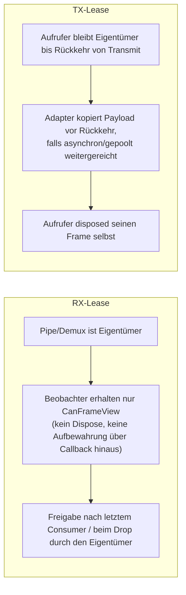
```mermaid
flowchart LR
    subgraph RX["RX-Lease"]
        RxOwn["Pipe/Demux ist Eigentümer"]
        RxView["Beobachter erhalten nur CanFrameView<br/>(kein Dispose, keine Aufbewahrung über Callback hinaus)"]
        RxFree["Freigabe nach letztem Consumer / beim Drop durch den Eigentümer"]
        RxOwn --> RxView --> RxFree
    end
    subgraph TX["TX-Lease"]
        TxOwn["Aufrufer bleibt Eigentümer bis Rückkehr von Transmit"]
        TxCopy["Adapter kopiert Payload vor Rückkehr,<br/>falls asynchron/gepoolt weitergereicht"]
        TxFree["Aufrufer disposed seinen Frame selbst"]
        TxOwn --> TxCopy --> TxFree
    end
```

Regeln: (1) `Dispose()` nur bei `OwnMemory==true`. (2) RX-Frames gehören der Pipe;
Event-Beobachter bekommen `CanFrameView` und dürfen ihn nicht über den Callback hinaus
halten. (3) TX-Frames gehören dem Aufrufer; Adapter, die den Frame nach `Transmit`
weiter referenzieren (Echo-Matching, BCM), **kopieren** vorher. Voraussetzung ist der
`OwnMemory`-Fix (Review §1.5, Empfehlung 2).

## 8.2 Fehler- und Ausnahmebehandlung

Zentraler Baustein ist `CanBusExceptionDispatcher.Report(exception, source, severity?)`.
Er klassifiziert per `CanExceptionPolicy` in Schwellen und leitet ab:

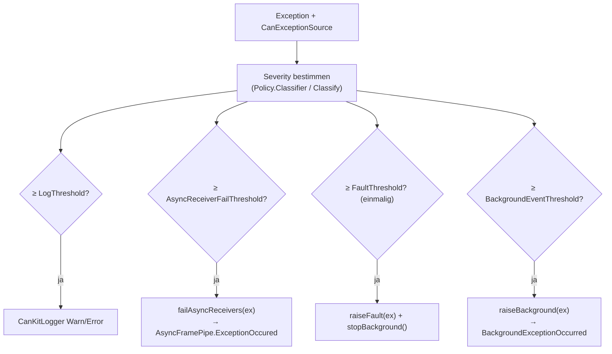
```mermaid
flowchart TB
    Ex["Exception + CanExceptionSource"] --> Classify["Severity bestimmen<br/>(Policy.Classifier / Classify)"]
    Classify --> Log{"≥ LogThreshold?"}
    Log -->|ja| LogW["CanKitLogger Warn/Error"]
    Classify --> FailA{"≥ AsyncReceiverFailThreshold?"}
    FailA -->|ja| FailAsync["failAsyncReceivers(ex)<br/>→ AsyncFramePipe.ExceptionOccured"]
    Classify --> Fault{"≥ FaultThreshold? (einmalig)"}
    Fault -->|ja| RaiseFault["raiseFault(ex) + stopBackground()"]
    Classify --> Notify{"≥ BackgroundEventThreshold?"}
    Notify -->|ja| Bg["raiseBackground(ex)<br/>→ BackgroundExceptionOccurred"]
```

Die Trennung **Fault** (terminal, stoppt Loops), **Background** (Benachrichtigung) und
**Async-Fail** (weckt wartende Consumer) ist ein tragfähiges Ist-Konzept. Schwäche:
Subscriber-Callback-Exceptions werden je Adapter erneut über `Report` verarbeitet
(gut), aber der ISO-TP-Scheduler wirft im Handler (`OnBackgroundExceptionOccurred`) –
Ziel: L2-Fehlerinfrastruktur nutzt denselben Dispatcher statt eigener Würfe (§11).

## 8.3 Nebenläufigkeit & Threading-Modell (Ist vs. Ziel-Aktor-Modell)

**Ist-Zustand:** je Bus ein Hintergrund-RX-Loop (epoll/Poll/Event) auf einem
`LongRunning`-Task; `AsyncFramePipe` (System.Threading.Channels) entkoppelt RX-Producer
von async-Consumern; `QueuedTxCanBus` ist ein optionaler TX-Queue-Wrapper. Höhere
Protokolle (ISO-TP-Prototyp) mutieren State (`_tx`, `_pendingOperations`, `Router._channels`)
ohne Synchronisation über Thread-Grenzen (Review §1.1/14).

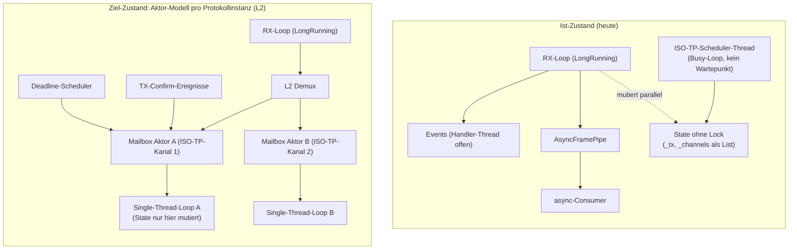
```mermaid
flowchart TB
    subgraph Ist["Ist-Zustand (heute)"]
        direction TB
        RxLoopI["RX-Loop (LongRunning)"] --> EventsI["Events (Handler-Thread offen)"]
        RxLoopI --> PipeI["AsyncFramePipe"]
        PipeI --> ConsI["async-Consumer"]
        SchedI["ISO-TP-Scheduler-Thread<br/>(Busy-Loop, kein Wartepunkt)"] --> StateI["State ohne Lock<br/>(_tx, _channels als List)"]
        RxLoopI -.mutiert parallel.-> StateI
    end

    subgraph Ziel["Ziel-Zustand: Aktor-Modell pro Protokollinstanz (L2)"]
        direction TB
        RxLoopZ["RX-Loop (LongRunning)"] --> DemuxZ["L2 Demux"]
        DemuxZ --> MboxA["Mailbox Aktor A (ISO-TP-Kanal 1)"]
        DemuxZ --> MboxB["Mailbox Aktor B (ISO-TP-Kanal 2)"]
        MboxA --> LoopA["Single-Thread-Loop A<br/>(State nur hier mutiert)"]
        MboxB --> LoopB["Single-Thread-Loop B"]
        TxEvZ["TX-Confirm-Ereignisse"] --> MboxA
        TimerZ["Deadline-Scheduler"] --> MboxA
    end
```

**Aktor-Modell (`FR-RAW-ACTOR-*`, umgesetzt):** Jede Protokollinstanz besitzt genau **eine
Mailbox** und einen **Single-Threaded-Bearbeitungsloop**. RX-Frames, TX-Confirmations und
Deadline-Ticks werden als Nachrichten in die Mailbox gepostet; der State wird
ausschließlich im Aktor-Loop mutiert. Damit entfallen die heutigen Datenrennen und der
Busy-Loop wird durch ereignisgetriebenes Warten (`SemaphoreSlim.Wait`/`WaitAsync`) ersetzt
(Review-Empfehlung 6). Umgesetzt als eigenständiges, von keinem anderen CanKit-Paket
abhängiges `IProtocolActor`/`ProtocolActor` in `CanKit.Pro.Actor` (siehe ADR-6) — der
ISO-TP-Prototyp selbst (funktional defekt, Review §1.1) nutzt es noch nicht; das ist
bewusst außerhalb des Umfangs dieser Umsetzung.

## 8.4 Ressourcen & Pooling

`IBufferAllocator` (Default- und ArrayPool-Variante) liefert `IMemoryOwner<byte>` für
Frame-Payloads; `CanFrame`-Owner-Factories übernehmen es optional. Ziel: Pooling nur in
Verbindung mit dem Ownership-Vertrag (8.1), sonst Use-after-free. Der ISO-TP-`FrameCodec`
verletzt dies heute (`ArrayPool.Rent` ohne Return, `Rent(8)` liefert 16 Byte → Validate-Throw,
Review §1.1/13).

## 8.5 Konfiguration / Options

Zweistufig: **Init** (`IBusInitOptionsConfigurator`, fluent: `Baud/Fd/SetFilter/
SetWorkMode/BufferAllocator/ExceptionPolicy/…`) → **Runtime** (`IBusRTOptionsConfigurator`,
read-only Zugriff auf `BitTiming`, `Filter`, `Features`, `AsyncBufferCapacity`,
`ExceptionPolicy`). Pro Adapter eigene Optionstypen; `CallOptionsConfigurator<TOption,TSelf>`
ist die generische Basis. `CanFeature`-Flags + Software-Fallback
(`SoftwareFeaturesFallBack`) erlauben, fehlende Hardware-Fähigkeiten softwareseitig zu
ersetzen.

## 8.6 Logging / Diagnostics

`CanKitLogger` ist die zentrale Log-Fassade (Warn/Error), vom Dispatcher best-effort
genutzt. `NativeHandle` (`BusNativeHandle`) erlaubt Interop-Diagnose. Schuld: gemischte
Zeitbasis (`DateTime.Now` vs. `UtcNow`) erschwert Korrelation (Review §2.5).

## 8.7 High-Res-Timing (plattformabhängig)

`SoftwarePeriodicTx` wählt zur Laufzeit den Timing-Pfad: Windows → Waitable Timer +
Spin-Endspurt (`Win_PreWait`), POSIX → `clock_nanosleep`. `PreciseDelay` und der
`BitTimingSolver` (Sample-Point → BRP/TSEG) ergänzen. SocketCAN nutzt zusätzlich den
Kernel-**BCM** für hardwarenahes periodisches TX. Schuld: macOS besitzt kein
`clock_nanosleep`; der Fehler wird verschluckt → Busy-Loop (Review §2.3). Ziel:
`OperatingSystem.IsMacOS()`-Fallback auf `Thread.Sleep`.

## 8.8 Erweiterbarkeit via SPI (Registry-Pipeline)

Adapter registrieren sich deklarativ: eine `[CanRegistryEntry]`-annotierte Klasse
implementiert Marker/Verträge (`ICanRegisterFactory`, `ICanRegisterProviders`,
`IRawRegisterEndpoint`). Die **Register×Entry-Pipeline** (`ExecuteRegistrationPipeline`)
sammelt per Reflection alle `ICanRegister` (Adapter-Kontexte) und alle `ICanRegistryEntry`
(Registrierungslogik, z. B. `RegisterProvidersEntry`, `RegisterFactoriesEntry`,
`RegisterEndpointsEntry`) und führt jede Entry gegen jeden Register nach `Order` aus.

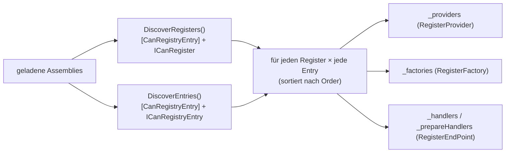
```mermaid
flowchart LR
    Asm["geladene Assemblies"] --> DR["DiscoverRegisters()<br/>[CanRegistryEntry] + ICanRegister"]
    Asm --> DE["DiscoverEntries()<br/>[CanRegistryEntry] + ICanRegistryEntry"]
    DR --> Pipe["für jeden Register × jede Entry<br/>(sortiert nach Order)"]
    DE --> Pipe
    Pipe --> P["_providers (RegisterProvider)"]
    Pipe --> F["_factories (RegisterFactory)"]
    Pipe --> H["_handlers / _prepareHandlers (RegisterEndPoint)"]
```

Ziel: L3/L4 (ISO-TP, UDS, …) nutzen denselben Mechanismus (`IIsoTpRegister`), sodass ein
Transport-/Protokollpaket ohne Kern-Änderung „andockt".

## 8.9 Teststrategie (Virtual-Loopback / Fake)

Zwei Ebenen: (1) **Fake-Native** – jede `Native/*.cs` hat einen `*.Fake.cs`-Spiegel;
mit `-c Fake` (`DefineConstants=FAKE`) baut/testet die CI ohne Hardware. (2)
**Virtual-Adapter** – ein In-Memory-`VirtualBusHub` verbindet mehrere `VirtualBus`-Instanzen
zu einem Loopback-Netz für Protokolltests. xUnit-**Matrix-Tests** (`tests/CanKit.Tests/Matrix`)
prüfen Adapter einheitlich. Lücke: keine ISO-TP-Tests (Review §4) – Ziel: SF/FF/CF/FC-Roundtrip,
STmin-Grenzwerte, SN-Folge, N_Bs/N_Cr-Timeouts gegen Virtual.

---

# 9. Architekturentscheidungen (ADRs)

### ADR-1: Reflexionsbasierte Registry mit Register×Entry-Pipeline
- **Kontext:** Adapter/Protokolle sollen ohne Kern-Änderung andocken; Konsumenten wollen
  `CanBus.Open("scheme://…")` ohne manuelle Registrierung.
- **Entscheidung:** Lazy-Singleton `CanRegistry.Registry` scannt geladene Assemblies per
  Reflection nach `[CanRegistryEntry]` und führt eine Register×Entry-Pipeline aus
  (`ExecuteRegistrationPipeline`).
- **Konsequenzen:** + hohe Erweiterbarkeit (Q1), Plug-in-Charakter. − Reflexions-/Ladekosten
  beim ersten Zugriff; Trimming/AOT erschwert; `Dictionary` ohne Lock (Ist-Schuld, §11).

### ADR-2: `CanFrame` als `readonly record struct` mit optionalem `IMemoryOwner`
- **Kontext:** Zero-Alloc-Frames (Q5) bei gleichzeitig optionalem gepooltem Backing.
- **Entscheidung:** Wert-Typ mit `Data:ReadOnlyMemory<byte>`, `OwnMemory`-Flag und
  `Dispose()`; read-only Sicht `CanFrameView`.
- **Konsequenzen:** + geringe Allokation, klare Read-only-Projektion. − Ownership über
  Kopien/Broadcasts schwer beherrschbar; `Dispose()` ignoriert heute `OwnMemory` (§11) →
  erzwingt den Ownership-Vertrag (ADR-9).

### ADR-3: `System.Threading.Channels` (`AsyncFramePipe`) zur RX-Entkopplung
- **Kontext:** RX-Loop (synchron, LongRunning) muss async-Consumer bedienen, ohne zu blockieren.
- **Entscheidung:** `AsyncFramePipe<T>` kapselt einen bounded/unbounded `Channel<T>` mit
  `DropOldest` und Exception-Puls.
- **Konsequenzen:** + saubere Producer/Consumer-Trennung, Backpressure-Politik. − Frame-Verlust
  bei Hintergrundfehlern (verwaister Reader), inkonsistenter Cancellation-Kontrakt (§11).

### ADR-4: ISO-TP als separates Transportpaket
- **Kontext:** ISO-TP ist optional und reifer als der Kern werden muss; Vendor-SDK-Kopplung vermeiden.
- **Entscheidung:** eigenes Paket `CanKit.Transport.IsoTp` (L3), unabhängig versioniert.
- **Konsequenzen:** + Kern bleibt schlank, unabhängige Release-Kadenz. − heute fälschliche
  `Peak.PCANBasic.NET`-Referenz und `Description=TODO` (§11); Paket muss `IsPackable=false`/„experimental".

### ADR-5 (umgesetzt): L2-Demux statt konkurrierendem `ReceiveAsync`
- **Kontext:** Mehrere Protokolle wollen denselben RX-Strom sehen; heute konkurrieren
  `ReceiveAsync`-Aufrufe um dieselben Frames.
- **Entscheidung:** L2 führt eine Subscription-Demux ein: ein RX-Strom → N unabhängige,
  gefilterte read-only Views.
- **Konsequenzen:** + mehrere Protokoll-Stacks parallel auf einem Bus (Q1). − zusätzliche
  Schicht, Broadcast-Kosten; erfordert Ownership-Vertrag (ADR-9).
- **Status:** Umgesetzt im neuen Paket `CanKit.Pro.RawCan` (`ICanBusService`/`CanBusService`,
  `ISubscription`, `CanIdFilter`). Die Demux hört genau einmal auf `ICanBus.FrameObserved` und
  fächert jede `CanFrameView` lock-frei (Copy-on-Write-Snapshot der Subscription-Registry) an alle
  Subscriptions auf; jede Subscription besitzt einen eigenen bounded Drop-Oldest-Channel, sodass
  eine langsame/blockierte Subscription weder andere noch das Basis-Event verzögert (FR-RAW-011).
  `Subscribe` bietet einen generischen Prädikat- und einen allokationsfreien `CanIdFilter`-Fast-Path
  (FR-RAW-010/013); `Dispose` meldet Subscriptions deterministisch ab und schließt ihren Channel
  (FR-RAW-012), das Verwerfen des Dienstes hängt sich vom `FrameObserved`-Event ab. Baut rein auf der
  bestehenden `ICanBus`-Oberfläche — kein Adapter-Eingriff. Abgesichert per Virtual-Loopback
  (`tests/CanKit.Tests/TestCases/RawCanSubscriptionTests.cs`). Offen: Laufzeit-Rekonfiguration der
  Filterkriterien (FR-RAW-014, Could) ist bewusst nicht Teil dieser Umsetzung.

### ADR-6 (umgesetzt): Aktor-Modell pro Protokollinstanz
- **Kontext:** ISO-TP-Prototyp mutiert State über Thread-Grenzen ohne Sync (Datenrennen, Busy-Loop).
- **Entscheidung:** jede Protokollinstanz = 1 Mailbox + 1 Single-Threaded-Loop; RX/TX-Confirm/
  Deadlines als Nachrichten.
- **Konsequenzen:** + deterministisches Threading (Q3/Q4), kein Lock-Zoo. − Umbau des ISO-TP-Kerns;
  Latenz durch Mailbox-Hop.
- **Status:** Umgesetzt als eigenständiges Paket `CanKit.Pro.Actor` (`IProtocolActor`/
  `ProtocolActor`), ohne Abhängigkeit auf irgendein anderes CanKit-Paket — reiner, wiederverwendbarer
  Single-Writer-Executor plus ereignisgetriebene Timer-Warteschlange, den Protokollschichten
  (ISO-TP, J1939, CANopen, …) einbinden. Genau eine `ConcurrentQueue<Action>`-Mailbox und eine
  nach Fälligkeit sortierte Timer-Liste werden ausschließlich vom jeweils laufenden Loop-Thread
  mutiert (kein Lock nötig, FR-RAW-020/021). Der Loop wartet blockierend auf einem
  `SemaphoreSlim` auf entweder neue Mailbox-Arbeit oder die nächste Timer-Fälligkeit,
  je nachdem was zuerst eintritt — kein Polling, kein Busy-Loop (FR-RAW-022). Ausführungskontext
  ist je Instanz wählbar (`ActorExecutionMode`, FR-RAW-024): `DedicatedThread` (Default, ein
  echter `Thread` für die gesamte Lebensdauer — messbar dasselbe Thread für jeden Callback, siehe
  Test), `ThreadPool` (kein dedizierter Thread, aber weiterhin strikt single-writer) oder
  `SynchronizationContext` (jeder Callback wird über `SynchronizationContext.Post` auf einen
  vom Aufrufer bereitgestellten Kontext umgeleitet, z. B. einen UI-Dispatcher). Hintergrundfehler
  aus `Post`/`Schedule`-Elementen werden gefangen und über `BackgroundExceptionOccurred` gemeldet;
  der Loop läuft danach weiter (FR-RAW-023) — `PostAsync`/`PostAsync<T>`-Fehlschläge laufen
  stattdessen über die zurückgegebene Task, da der Aufrufer sie ohnehin per `await` beobachtet.
  `Dispose` verwirft neue Arbeit sofort (`ObjectDisposedException`), führt aber bereits
  eingereihte Arbeit noch zu Ende, statt eine zum Dispose-Zeitpunkt wartende `PostAsync`-Task
  auf unbestimmte Zeit hängen zu lassen. Der ISO-TP-Prototyp selbst (funktional defekt, Review
  §1.1, u. a. 100 %-CPU-Busy-Loop und unsynchronisierte `List`-Zustände) nutzt `ProtocolActor`
  noch nicht — dessen Umbau ist bewusst nicht Teil dieser Umsetzung. Abgesichert per
  Unit-/Nebenläufigkeitstest (`tests/CanKit.Tests/TestCases/ProtocolActorTests.cs`), u. a.
  paralleler `PostAsync`-Zugriff aus echten OS-Threads ohne Datenverlust.

### ADR-7 (umgesetzt): TX-Confirm-Abstraktion
- **Kontext:** Manche Hardware liefert TX-Echo (`CanFeature.Echo`), andere nicht; Protokolle
  brauchen ein „gesendet"-Signal (N_As).
- **Entscheidung:** einheitliche `TxConfirmation` in L2; Echo-Matching wo verfügbar, sonst
  Approximation (`IsApproximated=true`).
- **Konsequenzen:** + protokollunabhängige Confirm-Semantik. − Approximation ist ungenau
  (Jitter), muss dokumentiert werden.
- **Status:** Umgesetzt in `CanKit.Pro.RawCan` (`ICanBusService.SendConfirmed`). Nutzung von
  Echo-Matching hängt von **zwei** Bedingungen ab: `CanFeature.Echo` (Hardware-Fähigkeit) UND
  `WorkMode == ChannelWorkMode.Echo` (Session-Opt-in) — reines Vorhandensein der Fähigkeit reicht
  nicht. Ausstehende Bestätigungen werden pro (ID, Payload)-Schlüssel FIFO in einer
  `LinkedList<PendingSend>` geführt, sodass mehrere gleichzeitige, inhaltsgleiche Sendevorgänge
  je einzeln (nicht querverwechselt) bestätigt werden (FR-RAW-031) — genau die Fehlerklasse, die
  im Review als `QueuedDeadline.Enqueue`-Absturz bei identischen Frames benannt wurde. Fehlschläge
  (Timeout, BusOff, Ablehnung durch den Treiber) lösen die zurückgegebene Task beobachtbar auf
  (`TxConfirmation.FailureReason`), nie unbegrenztes Hängen; explizite Aufrufer-Cancellation läuft
  getrennt davon über Task-Cancellation. `BusState.BusOff` löst über `ICanBus.FaultOccurred` ein
  proaktives Fast-Fail aller offenen Bestätigungen aus, statt auf den vollen Timeout zu warten.
  `CanKit.Adapter.Virtual` deklarierte `CanFeature.Echo` bislang nicht statisch (im Gegensatz zu
  allen echten Adaptern) und wurde dafür ergänzt — sonst wäre Echo-Matching mangels
  hardwareunabhängiger CI gar nicht testbar gewesen. Abgesichert per Virtual-Loopback
  (`tests/CanKit.Tests/TestCases/TxConfirmTests.cs`).

### ADR-8: Fake-Native + Virtual-Loopback als Teststrategie
- **Kontext:** CI ohne CAN-Hardware, deterministische Protokolltests.
- **Entscheidung:** `*.Fake.cs` je Adapter (`-c Fake`) + In-Memory-`Virtual`-Hub.
- **Konsequenzen:** + hardwarelose Matrix-CI (Q4). − Fake bildet Timing/Fehlerfälle nur
  begrenzt ab; Virtual-Hub hat heute Ownership-/Leak-Schulden (§11).

### ADR-9 (teilweise umgesetzt): Verbindlicher Frame-Ownership-/Lifetime-Vertrag
- **Kontext:** geteilte `CanFrame`-Werte mit Owner → Use-after-free/Double-Dispose.
- **Entscheidung:** RX-Lease (Pipe besitzt; Beobachter → View), TX-Lease (Aufrufer besitzt;
  Adapter kopiert); `Dispose()` respektiert `OwnMemory`.
- **Konsequenzen:** + sichere Grundlage für L2–L4 (Q1/Q5). − erfordert Anpassung von Pipe,
  QueuedCanBus, Virtual-Hub, ISO-TP-Scheduler.
- **Status:** `Dispose()`/`OwnMemory` und Virtual-Hub (`CanFrame.Duplicate`, Broadcast-Kopie,
  `_hubs`-Leak-Fix) sind umgesetzt und per Unit-/Virtual-Loopback-Test abgesichert
  (`tests/CanKit.Tests/TestCases/CanFrameTests.cs`,
  `tests/CanKit.Tests/TestCases/VirtualBusOwnershipTests.cs`). Offen: TX-Lease-Kopie in den
  übrigen L0-Adaptern und im ISO-TP-Scheduler (Echo-Matching).

### ADR-10 (umgesetzt): Adressierungs-Helfer als eigenständiges Paket
- **Kontext:** 11-/29-Bit-ID- und J1939-PGN-Logik existierte nur als ein einziger, fest auf eine
  Diagnose-PGN zugeschnittener Sonderfall in `IsoTpEndpoint.CreateNormalFixed` (`Build29`), ohne
  allgemeine Dekomposition und ohne Wiederverwendbarkeit für andere Protokollschichten (Review
  „Adressierungs-/ID-Helfer" fehlt).
- **Entscheidung:** reine, abhängigkeitsfreie Helferfunktionen in einem eigenen Paket
  `CanKit.Pro.Addressing`, getrennt von `CanKit.Pro.RawCan`/`CanKit.Pro.Actor`, da die Logik
  weder Frame-Dispatch noch Threading betrifft, sondern reine Bitarithmetik auf `uint`-IDs ist.
- **Konsequenzen:** + wiederverwendbar für ISO-TP/J1939/CANopen ohne Kopplung an RawCan/Actor. −
  ein weiteres kleines Paket in der Solution.
- **Status:** Umgesetzt: `CanIdRange` (validierte 11-/29-Bit-Prüfung, FR-RAW-040) sowie
  `J1939Id`/`J1939Fields` (allgemeine PGN/Priorität/PDU-Format/PDU-Specific/Quelladresse-
  Komposition und -Dekomposition inkl. PDU1/PDU2-Unterscheidung und abgeleiteter Zieladresse),
  `J1939Name` (64-Bit-NAME-Felder und SAE-J1939-81-Address-Claim-Priorität) und `J1939Pgn`
  (Request/TP/Address-Claim-Klassifikation inkl. BAM-Control-Byte-Grundlage, FR-RAW-040 plus
  Vorbereitung für FR-J1939-001/003) — verallgemeinert `IsoTpEndpoint.Build29`, das weiterhin unverändert besteht (kein
  Umbau bestehender Adapter/Transporte in dieser Umsetzung). Zusätzlich `CanIdFilter.Overlaps`
  und `ICanBusService.FindOverlappingFilterSubscriptions()` in `CanKit.Pro.RawCan` (FR-RAW-041,
  Should): erkennt überlappende Range/Mask-Filter unter den aktuell registrierten Subscriptions
  als Fehldiagnose-Hilfe bei falsch konfigurierten Protokollinstanzen — Range/Range und
  Mask/Mask-Überlappung über direkte Intervall-/Bitvergleiche, Range/Mask-Überlappung über eine
  bitweise Existenzsuche (O(Bitbreite), kein Aufzählen einzelner ID-Werte). Abgesichert per
  Unit-Test (`tests/CanKit.Tests/TestCases/AddressingTests.cs`,
  `tests/CanKit.Tests/TestCases/CanIdFilterOverlapTests.cs`).

### ADR-11 (umgesetzt): Fehler-/Timeout-Infrastruktur als eigenständiges Paket
- **Kontext:** L3-Protokolle brauchen zeitgebundene Zustandsübergänge (ISO-TP N_Bs/N_Cr, J1939-,
  UDS-P2-, CANopen-SDO-Timeouts) und müssen Bus-Fehlerzustände (`ErrWarning`/`ErrPassive`/`BusOff`)
  kennen, um aktive Übertragungen kontrolliert abzubrechen/zu pausieren. Der ISO-TP-Prototyp
  pflegte zwar `Deadline`-Werte, prüfte deren Ablauf aber nie (Review §1.1 Punkt 10: „Deadlines
  werden gepflegt, aber nie geprüft"), und `ICanBus.BusState` besitzt kein Änderungs-Event.
- **Entscheidung:** eine wiederverwendbare, aktorgetriebene Infrastruktur in einem eigenen Paket
  `CanKit.Pro.Reliability`, das ausschließlich auf `CanKit.Core` (für `ICanBus`/`BusState`) und
  `CanKit.Pro.Actor` (für `IProtocolActor`) aufbaut — getrennt von `CanKit.Pro.RawCan`, da es weder
  Frame-Demux noch TX-Confirm betrifft. Deadlines werden **nicht** als eigenständige Timer mit
  eigenem Thread realisiert, sondern über `IProtocolActor.Schedule` auf dem ohnehin vorhandenen
  Aktor-Loop jeder Protokollinstanz eingeplant (FR-RAW-020); ebenso läuft die Bus-Zustandsprüfung
  als selbst-rearmender Poll auf demselben `Schedule` statt als freilaufender Timer/Busy-Loop.
- **Konsequenzen:** + der Ablauf einer Deadline wird nachweislich eingeplant und geprüft (behebt die
  Fehlerklasse aus Review §1.1 Punkt 10), einmalig per `Interlocked`-CAS aufgelöst
  (`Pending → Expired|Completed|Cancelled`), und Ausnahmen aus `onExpired` nutzen den bestehenden
  `BackgroundExceptionOccurred`-Kanal des Aktors statt eines zweiten Fehlerkanals; + Bus-Zustands-
  Übergänge (auch Erholung, z. B. `BusOff → ErrActive`) werden edge-getriggert gepusht, ohne
  Busy-Loop. − ein weiteres kleines Paket in der Solution; − der `BusState`-Getter läuft je
  Poll-Tick synchron auf dem Instanz-Loop (bewusster Tradeoff, siehe README). Das `Rearm`-Verhalten
  ist bei Rennen gegen einen bereits dispatchten Fire nur „best-effort" (per Generationszähler
  gegen Doppelauslösung stale gewordener Timer abgesichert), analog dem dokumentierten
  `Schedule`-Vorbehalt des Aktors.
- **Status:** Umgesetzt: `IDeadlineScheduler`/`DeadlineScheduler`/`Deadline` (FR-RAW-050) sowie
  `BusStateMonitor`/`BusStateChangedEventArgs`/`BusStateExtensions` (FR-RAW-051), abgesichert per
  Unit-/Virtual-Loopback-Test (`tests/CanKit.Tests/TestCases/DeadlineTests.cs`,
  `tests/CanKit.Tests/TestCases/BusStateMonitorTests.cs`). Die Primitive ist **reusable L2-
  Infrastruktur** und wird vom weiterhin defekten ISO-TP-Prototyp noch nicht genutzt (dessen
  Scheduler bleibt unverändert, eigener Must-Fix FR-TP-xxx). FR-RAW-052 (reservierte/ungültige
  Protokollwerte, z. B. reservierte ISO-TP-STmin-Werte) ist bewusst **nicht** hier umgesetzt,
  sondern als protokoll-codec-spezifische Aufgabe dem künftigen ISO-TP-Fix FR-TP-007 (Review §1.1
  Punkt 6) zugeordnet — eine generische „Reserved-Value"-Abstraktion wäre hier spekulativ.

---

# 10. Qualitätsanforderungen

## 10.1 Qualitätsbaum

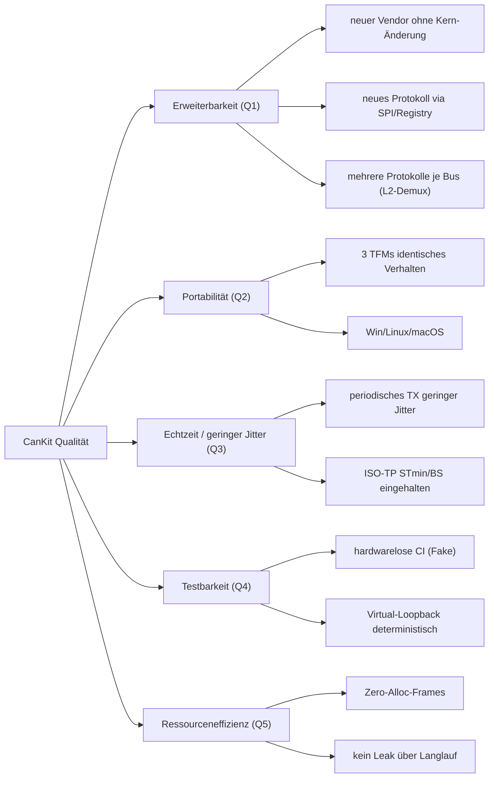
```mermaid
flowchart LR
    Root["CanKit Qualität"] --> Ext["Erweiterbarkeit (Q1)"]
    Root --> Port["Portabilität (Q2)"]
    Root --> RT["Echtzeit / geringer Jitter (Q3)"]
    Root --> Test["Testbarkeit (Q4)"]
    Root --> Res["Ressourceneffizienz (Q5)"]

    Ext --> E1["neuer Vendor ohne Kern-Änderung"]
    Ext --> E2["neues Protokoll via SPI/Registry"]
    Ext --> E3["mehrere Protokolle je Bus (L2-Demux)"]
    Port --> P1["3 TFMs identisches Verhalten"]
    Port --> P2["Win/Linux/macOS"]
    RT --> R1["periodisches TX geringer Jitter"]
    RT --> R2["ISO-TP STmin/BS eingehalten"]
    Test --> T1["hardwarelose CI (Fake)"]
    Test --> T2["Virtual-Loopback deterministisch"]
    Res --> S1["Zero-Alloc-Frames"]
    Res --> S2["kein Leak über Langlauf"]
```

## 10.2 Qualitätsszenarien (Stimulus / Response / Messgröße)

| ID | Qualität | Szenario (Stimulus → Response) | Messgröße | SRS |
|----|----------|--------------------------------|-----------|-----|
| QS-1 | Erweiterbarkeit | Entwickler fügt neuen Vendor-Adapter als eigenes Projekt mit `[CanRegistryEntry]` hinzu → Bus über `scheme://` öffenbar ohne Kern-Änderung. | 0 geänderte Kern-Dateien; Adapter in ≤ 1 Tag lauffähig. | NFR-EXT-1 |
| QS-2 | Erweiterbarkeit | Zwei Protokolle (ISO-TP + CANopen) laufen gleichzeitig auf einem Bus → beide erhalten ihren gefilterten RX-Strom. | Keine verlorenen Frames; kein konkurrierendes `ReceiveAsync`. | FR-RAW-DEMUX-1 |
| QS-3 | Echtzeit | Periodisches TX mit 1 ms Periode über 60 s auf `net8.0-windows`. | Jitter p99 ≤ definierte Grenze; keine Busy-Loop-CPU-Last. | NFR-RT-1 |
| QS-4 | Echtzeit | ISO-TP-Sender mit STmin=10 ms, BS=8 → CF-Abstände eingehalten. | Mittlerer CF-Abstand ∈ [STmin, STmin+Toleranz]. | FR-TP-STMIN |
| QS-5 | Portabilität | Identischer Testfall auf netstandard2.0 (.NET Fx), net8.0 (Linux), net8.0-windows. | Grüne Matrix auf allen 3 TFMs. | NFR-PORT-1 |
| QS-6 | Testbarkeit | CI-Lauf ohne angeschlossene Hardware (`-c Fake`). | Alle Adapter-Suites grün ohne Geräte. | NFR-TEST-1 |
| QS-7 | Ressourceneffizienz | 24 h Dauerlauf mit RX/TX-Last. | Konstanter Speicher (kein Hub-/Event-Leak); keine Use-after-free-Abstürze. | NFR-RES-1 |
| QS-8 | Robustheit | Fehlerhafte Gegenstelle sendet reservierte STmin-/Längenwerte. | Kein Crash im RX-Pfad; reservierte Werte → 127 ms behandelt. | FR-TP-ROBUST |

---

# 11. Risiken und technische Schulden

Direkt aus dem Deep-Code-Review (`docs/reviews/2026-07-14-deep-code-review.md`) abgeleitet.
Priorisierung: **K** = kritisch, **W** = wichtig, **G** = gering.

| Prio | Risiko / Schuld | Auswirkung | Gegenmaßnahme | Review § |
|------|------------------|-----------|---------------|----------|
| K | **ISO-TP funktional defekt (WIP)**: `IsoTp.Open` wirft `NotImplementedException`; invertiertes `canfd` in allen 4 Buildern; FC trägt FF-PCI; FC-Padding nullt BS/STmin; FF-Längenparsing verliert High-Nibble; `EncodeStmin` wirft bei 0/1 ms; CF-Segmentierung (Byte 6 verloren, SN=0 statt 1); Multi-Frame-TX startet nie (`WaitFc`+`IsReadyToSendData=false`). | Jede ISO-TP-Übertragung schlägt fehl bzw. hängt; Paket nicht funktionsfähig. | Protokollfehler beheben; Scheduler ereignisgetrieben (`AsyncAutoResetEvent`) + Deadline-Prüfung; Virtual-Loopback-Tests; **bis dahin `IsPackable=false`/„experimental"**. *Hinweis (Teil-Baustein Review §1.1 Punkt 10 „Deadlines werden gepflegt, aber nie geprüft"):* die wiederverwendbare, aktorgetriebene Deadline-Primitive `CanKit.Pro.Reliability.Deadline` (FR-RAW-050) samt `BusStateMonitor` (FR-RAW-051) existiert nun als L2-Infrastruktur (ADR-11) und steht zur Übernahme durch ISO-TP/L3 bereit — der ISO-TP-Scheduler selbst ist von diesem PR jedoch **unverändert** und bleibt eigener Must-Fix. | §1.1 |
| K | ✅ *Behoben.* **Frame-Ownership**: `CanFrame.Dispose()` ignorierte `OwnMemory` (gab Owner immer frei). | Use-after-free / Double-Dispose bei gepoolten Buffern über Events/Pipe/Virtual-Hub. | `Dispose()` → `if (OwnMemory) _memoryOwner?.Dispose();`; `CanFrame.Duplicate(IBufferAllocator)` ergänzt; Ownership-Vertrag (8.1/ADR-9) durchgesetzt. | §1.5, §2.1 |
| K | ✅ *Behoben.* **`QueuedCanBus`-Retry-Stau**: Batch-Reste blieben bis zum nächsten `Enqueue` liegen (blockierte in `WaitToReadAsync`). | Frames wurden verspätet oder nie gesendet; Backoff wirkungslos. | `WaitToReadAsync` nur bei `index==0`; sonst direkter Retry mit Backoff; nur die gültige Batch-Teilmenge wird an `Transmit` übergeben. | §1.2 |
| K | ✅ *Behoben.* **SocketCAN/ZLG Stopwatch nie gestartet**: `remainingTime` blieb konstant. | Sende-`poll()`-Endlosschleife bei nicht-annehmendem, schreibbarem Bus; unbegrenzte Wartezeit. | `Stopwatch.StartNew()` in `SocketCanBus.Transmit` (2×) und 3 ZLG-Transceivern. | §1.3 |
| K | ✅ *Behoben.* **BCMPeriodicTx `Update()` FD-Zweig**: `Can20` doppelt (Copy-Paste) statt `CanFd`. | Jedes `Update(fdFrame)` warf `NotSupportedException`; `RemainingCount` unzuverlässig (EAGAIN, weiterhin offen). | FD-Zweig auf `CanFd` korrigiert; `RemainingCount`-Robustheit per `poll` bleibt offen. | §1.4 |
| W | **macOS-Timing-Busy-Loop**: `clock_nanosleep` fehlt auf macOS, Exception verschluckt. | `PreWait` kehrt sofort zurück → sendet Frames maximal schnell (Bus-Flut). | `OperatingSystem.IsMacOS()` → `Thread.Sleep`-Fallback. | §2.3 |
| W | **AsyncFramePipe Fehlerpfade**: verwaister Reader konsumiert später Frame; Nutzer-Cancellation wird geschluckt. | Frame-Verlust nach Hintergrundfehlern; inkonsistenter Cancellation-Kontrakt. | Reader-Lebenszyklus an `WhenAny` binden; Cancellation-Kontrakt vereinheitlichen + dokumentieren. | §2.2 |
| W | **Nebenläufigkeit im ISO-TP**: `_tx`, `_pendingOperations`, `Router._channels` (List) ohne Sync; `SetResult`/`SetException` statt `Try*`; Scheduler-Busy-Loop (100 % CPU), `RunAsync` nirgends aufgerufen. | Datenrennen (`InvalidOperationException`), CPU-Last, Nichtfunktion. | Aktor-Modell (ADR-6): 1 Mailbox/Loop je Instanz; `TrySet*`; ereignisgetriebenes Warten. | §1.1/9,14 |
| W | ✅ *Behoben.* **Virtual-Hub-Leak & Ownership**: `VirtualBusHub._hubs` (static) entfernte leere Hubs nie; Broadcast ohne Kopie. | Speicher-Leak über Sessions; Use-after-free zwischen Empfängern/Sender. | Leere Hubs werden beim Verlassen des letzten Mitglieds entfernt (`Join`/`Detach`, atomar); `Broadcast` kopiert je Empfänger via `CanFrame.Duplicate(...)` (Lease-Semantik). | §2.4 |
| W | **`CanBus.Open<..>(DeviceType)` Device-Leak**: bei Wurf nach `CreateDevice` wird Device nie disposed. | Natives Handle-Leak. | `try/finally` um `Open(device,…)`; Device bei Fehler disposen. | §2.5 |
| W | **`BitTimingSolver.FromSamplePoint`**: `Clamp` wirft statt `continue` bei kleinen NTQ. | Gesamte Timing-Suche crasht für bestimmte Limits. | ungültige NTQ überspringen (`continue`). | §2.5 |
| W | **`CanEndpoint.Parse` lowercased Host**: `zlg://USBCANFD-200U` → `usbcanfd-200u`; Sonderzeichen werfen. | Adapter müssen case-insensitiv sein (nicht garantiert); Namen mit Leerzeichen scheitern. | Host case-preserving parsen; Namensregeln dokumentieren. | §2.5 |
| G | **Typos in öffentlicher API**: Namespace `Excpetions`, `ReadTImeOutMs`, `ExceptionOccured`. | Nach 1.0 nur als Breaking Change korrigierbar. | Vor 1.0 bereinigen. | §3 |
| G | **ISO-TP-Packaging**: `Peak.PCANBasic.NET`-Referenz + `Description=TODO`; gemischte Namespaces. | ISO-TP-NuGet zieht grundlos PEAK-Paket; Namespaces inkonsistent. | Referenz entfernen; Namespaces vereinheitlichen; Description setzen. | §1.1/16, §3 |
| G | **Zeitbasis gemischt** (`DateTime.Now` vs. `UtcNow`) und Copy-Paste-Logtexte („Vector CAN bus", „ControlCAN poll loop"). | Korrelation erschwert; irreführende Logs. | Einheitlich UTC; Logtexte korrigieren. | §2.4, §2.5 |
| G | **CI-Trigger tot** (`branches:[main]`, Default `master`); kein ISO-TP-Workflow. | Push-Trigger feuert nicht; Transport ungetestet. | Trigger auf `master`; ISO-TP-Workflow ergänzen. | §3, §4 |

**Gesamtbewertung:** L0/L1 sind produktionsnah; die punktuellen kritischen Bugs
(Stopwatch, BCM, QueuedCanBus, Frame-Ownership, Virtual-Hub) sind behoben (siehe ✅-Markierungen
oben). L3 (ISO-TP) ist weiterhin ein nicht funktionsfähiger Prototyp. Von den vier
strukturellen L2-Lücken ist der Frame-Ownership-Vertrag (FR-RAW-001..005) für L1-Kern und
Virtual-Adapter umgesetzt (siehe §8.1); Demux, Threading/Aktor und TX-Confirm sind weiterhin
Ziel-Architektur und Voraussetzung für belastbare L3/L4-Stacks.

---

# 12. Glossar

| Begriff | Bedeutung |
|---------|-----------|
| **CAN** | Controller Area Network; serieller Feldbus (ISO 11898). |
| **CAN FD** | CAN with Flexible Data-Rate; bis 64 Byte Nutzlast, Bitraten-Umschaltung (BRS). |
| **Classic CAN / CAN 2.0** | Klassisches CAN mit max. 8 Byte Nutzlast. |
| **Frame** | Grundeinheit der CAN-Übertragung (ID + Daten + Flags). In CanKit `CanFrame`. |
| **DLC** | Data Length Code; kodiert die Nutzlastlänge (bei FD nicht linear, `DlcToLen`). |
| **EFF/SFF** | Extended (29-bit) / Standard (11-bit) Frame Format. |
| **BRS / ESI** | Bit Rate Switch / Error State Indicator (CAN-FD-Flags). |
| **RTR** | Remote Transmission Request (Remote-Frame). |
| **TEC / REC** | Transmit/Receive Error Counter (Bus-Fehlerzähler). |
| **PDU** | Protocol Data Unit; Protokoll-Nachrichteneinheit (oberhalb einzelner Frames). |
| **ISO-TP** | ISO 15765-2 Transport-Protokoll; segmentiert PDUs > Frame-Größe. |
| **SF / FF / CF / FC** | Single / First / Consecutive Frame / Flow Control (ISO-TP-PCI-Typen). |
| **PCI** | Protocol Control Information; ISO-TP-Kopf im ersten/mehreren Byte(s). |
| **FS: CTS/WT/OVFLW** | Flow Status im FC: Clear-To-Send / Wait / Overflow. |
| **BS** | Block Size; Anzahl CF pro Block vor nächstem FC. |
| **STmin** | Separation Time minimum; Mindestabstand zwischen CFs. |
| **SN** | Sequence Number der Consecutive Frames (1..15, mod 16). |
| **N_As/N_Ar/N_Bs/N_Br/N_Cs/N_Cr** | ISO-15765-2-Zeitüberwachungen (Sender/Empfänger, je Frame-Phase). |
| **WFTmax** | Maximale Anzahl aufeinanderfolgender FC=WT, bevor abgebrochen wird. |
| **Addressing (Normal/NormalFixed/Extended/Mixed)** | ISO-TP-Adressierungsformate; bei Extended/Mixed belegt ein Nutzbyte die Adresse (`UsePayload`). |
| **J1939** | SAE-J1939-Protokollfamilie (29-bit) für Nutzfahrzeuge. |
| **PGN** | Parameter Group Number (J1939-Nachrichten-ID-Anteil). |
| **SPN** | Suspect Parameter Number (einzelnes Signal in J1939). |
| **TP.BAM / TP.CM** | J1939 Transport: Broadcast Announce Message / Connection Management (RTS/CTS/DT/EndOfMsgAck). |
| **Address Claiming** | J1939-Verfahren zur eindeutigen Adressvergabe am Bus. |
| **UDS** | Unified Diagnostic Services (ISO 14229); Diagnose über ISO-TP. |
| **SID** | Service Identifier (UDS-Dienst-Byte). |
| **NRC** | Negative Response Code (UDS-Fehlercode). |
| **0x78 (ResponsePending)** | UDS-NRC „requestCorrectlyReceived-ResponsePending"; verlängert P2*. |
| **DID** | Data Identifier (UDS, z. B. bei ReadDataByIdentifier 0x22). |
| **DTC** | Diagnostic Trouble Code (UDS-Fehlerspeicher-Eintrag). |
| **CANopen** | Höheres Protokoll (CiA 301) auf CAN. |
| **SDO / PDO** | Service / Process Data Object (CANopen). |
| **NMT / EMCY** | Network Management / Emergency Object (CANopen). |
| **HAWE** | Hier: herstellerspezifisches Privatprotokoll (Ziel-L4). |
| **SPI (hier)** | Service Provider Interface; interne Erweiterungspunkte (`CanKit.Abstractions.SPI.*`), nicht der Hardware-SPI-Bus. |
| **Fake-Native** | `*.Fake.cs`-Spiegel der P/Invoke-Schicht für hardwarelose Builds (`-c Fake`). |
| **Virtual-Hub** | In-Memory-Loopback-Adapter (`VirtualBusHub`) für Tests. |
| **BCM** | Broadcast Manager (Linux/SocketCAN) für kernelseitiges periodisches TX. |
| **Echo / TX-Confirm** | Rückgemeldeter gesendeter Frame (`IsEcho`); Basis der TX-Bestätigung. |
| **Aktor-Modell** | Nebenläufigkeitsmodell: 1 Mailbox + 1 Bearbeitungs-Thread je Protokollinstanz. |
| **Ownership-/Lifetime-Vertrag** | Regeln, wer einen `CanFrame`/dessen `IMemoryOwner` besitzt und freigibt. |
| **L0–L4** | Schichtenmodell: Adapter / Raw-CAN-Kern / Raw-CAN-Dienste (NEU) / Transport / Anwendungsprotokolle. |

---

*Ende des Dokuments. Ist-Aussagen (Interface-Member, State-Namen, Registry-Ablauf,
ISO-TP-Interna) wurden gegen die Quelldateien in `src/` verifiziert; Ziel-Architektur-
Bausteine (L2, Aktor-Modell, TX-Confirm, Ownership-Vertrag) sind als solche markiert und
referenzieren die SRS-Requirement-IDs sowie das Review-Dokument.*
